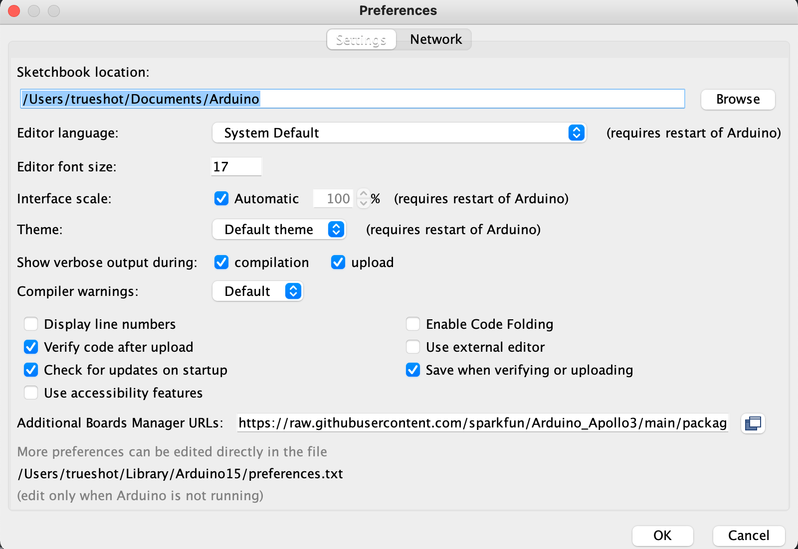
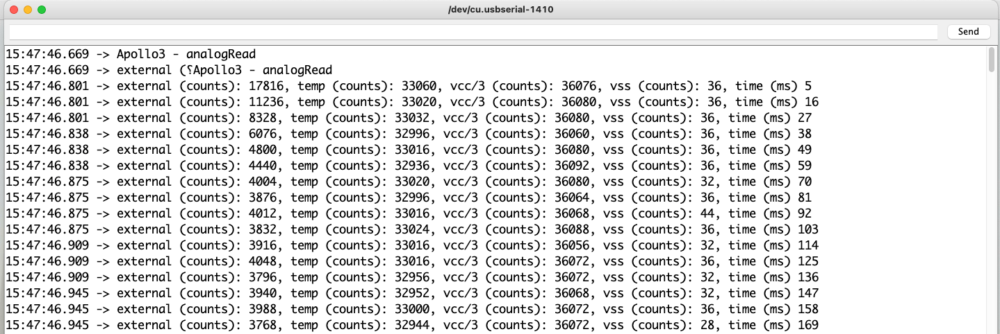
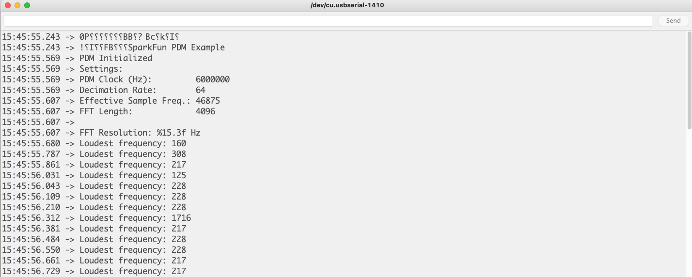

# Lab 1

## Summary

In this lab, I set up the Arduino IDE to be able to be used with an Artemis
board. From obtaining and setting up the hardware components to running basic
programs on the board, the lab allowed me to get some exposure to embedded
systems that I will be learning to use throughout this class.

## Procedure

The first step was to install the Arduino IDE. This was simple, as I had already
worked with Arduino in the past, and as such, I already had the IDE on my
computer. However, I did have to set up the IDE to be compatible with the
Artemis board, so I added the SparkFun repository URL for the Apollo 3 processor
and enabled the Artemis board.

  

With this setup, I was ready to plug in the Artemis board into my computer. Once
plugged in, I loaded the blink example code and uploaded it to the board. At
first, nothing seemed to change, but later I realized that a simple change of
the baud rate to 115k allowed the LED to show its blinking. I had known to try
this because the lab handout specified that the blink might not work on the
first try. Thanks to the instructions, I learned that the baud rate can impact
certain behaviors of the board. Without even realizing it at the time, I had
flashed the first program from the Arduino IDE onto the Artemis board.

Next, I uploaded the example serial code to see whether I could read and write
serial messages over the USB-C cable. Sure enough, the messages transmitted
correctly without any problems, and I could even write messages to the board
over serial, which can be seen here:

The next item to test was the reading analog messages and checking whether the
temperature sensor worked properly on the Artemis board. This was a bit harder
to confirm whether it was working correctly, as it is pretty hard to
instantaneously change the temperature of the board without external tools. Here
are some of the messages the monitor displayed:

  

Finally, I wanted to check the microphone using the example code to test the PDM
(Pulse Density Microphone) on the Artemis board. Using this code, I noticed that
it does indeed track roughly correct frequencies of noise that it picks up,
which surprisingly exceeded my original expectations. As I increased my pitch of
whistling, the loudest frequency went up much higher.

  

## Conclusion

This lab was a fun introduction to the Artemis board and a nice refresher to the
Arduino IDE. I was able to understand how to program the board, blink the LED on
the board, read and write serial messages over USB, display the output from the
temperature sensor, and measure the loudest frequency recorded by the Pulse
Density Microphone. My biggest takeaway was that though the Artemis board may
not look like much, it certainly packs a powerful processor and a set of sensors
able to accomplish a lot of useful tasks.

## References

- [Artemis board setup
  instructions](https://learn.sparkfun.com/tutorials/artemis-development-with-arduino)
- [Arduino website](https://www.arduino.cc/)

[Back to main](../index.md)
