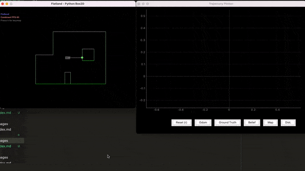

# Lab 10

## Summary

In this lab, I learned to use a simulation environment for a virtual robot.
Using the simulator, I was able to demonstrate a basic control of my robot with
both open and closed loop controllers. In addition, I plotted various robot data
related to its position from the odometry and the expected pose.

## Procedure

### Setup

The lab required using Python for the plotter and interfacing with the robot in
the virtual environment using the controller. For this, I installed a fresh venv
of Python 3.10 with all the necessary libraries.

### Simulator

The simulator represents a closed room space with the robot around the center of
the room. The robot is represented by three pose values: x, y, and yaw
(orientation). Using basic API calls in Python, the robot can change any of its
three values, which can effectively simulate a rotation or translation.

In addition to the simulator, there exists a plotter that maps two data series:

1. The odometry (sensor) data, which is measured by the "sensors" on the robot.
   These sensors are simulated.
2. The ground truth pose of the robot. This is exact.

### Open loop control

For a basic demonstration of open loop control of the virtual robot, I used a
simple set of calls to the `cmdr` variable to execute a rough square trajectory.
Here is the code I used to do this:

```python
def plot():
    pose, gt_pose = cmdr.get_pose()

    cmdr.plot_odom(pose[0], pose[1])
    cmdr.plot_gt(gt_pose[0], gt_pose[1])

for i in range(4):
    cmdr.set_vel(1, 0)
    await asyncio.sleep(0.5)

    cmdr.set_vel(0, np.pi)
    await asyncio.sleep(0.5)

    cmdr.set_vel(0, 0)

    plot()
```

<p align="center">
    
</p>

As evident from the animation, the ground truth (green) follows the exact path
that the robot took in its trajectory. The odometry data (red) is far less
accurate, but tries to follow the robot's estimated pose using a virtual "IMU."
As the duration of the velocity command of the `cmdr` is forever, it must be
explicitly changed to zero to stop the robot's motion.

Another interesting thing of note is that the robot does not always execute the
same shape. One possible reason for this is due to the `asyncio` delay, since
the library is going to have some processing delay time depending on the
conditions of the computer, the Jupyter server, etc. Another explanation is that
the turns use `np.pi` which is going to have floating point approximation which
may lead to observing nondeterministic behavior.

### Closed loop control

With these tools for the simulator, I was able to design a closed loop
controller for the robot. Here is a snippet of code that demonstrates how the
robot is able to intelligently avoid obstacles (most of the time -- more on this
later):

```python
def drive(duration):
    start = time.time()
    turn_threshold = 0.5
    max_speed = speed = 20  # The initial speed

    while (time.time() - start < duration):
        if (get_front_dist() > speed * 0.1 + turn_threshold):
            await move_forward(speed, 0.1)
            speed = min(speed * 2, max_speed)
        elif (get_front_dist() < turn_threshold):
            await turn(random.random() * 360)
        else:
            speed /= 2

drive(10)
```

The algorithm works as follows:

- The initial parameters are set: the tolerance (front distance) for turning,
  the max (and starting) speed of the robot, and how long to run the algorithm.
- While the robot is far away from the front wall, move forward at double the
  speed, up to the max speed.
- If the robot is within the turn threshold, turn in a random direction.
- If the robot is close to the wall but still can move before turning, reduce
  its speed by half.

Here is a demo of the robot in action with the corresponding plot:

<p align="center">
    <iframe width="90%" height="400" src="https://www.youtube.com/embed/11Qu6oVqM0U" title="YouTube video player" frameborder="0" allow="accelerometer; autoplay; clipboard-write; encrypted-media; gyroscope; picture-in-picture" allowfullscreen></iframe>
</p>

For my closed loop controller, I was able to achieve what I wanted without a
specific turn algorithm. Because of how often the controller recomputes the next
action (as soon as the Python process can), using randomized turns worked well
enough. I found that a reasonable speed was around 15-20. Any speed faster than
that could sometimes lead to collisions due to processing delay. As evident in
the video, the robot can move pretty quickly without colliding, and because I
set the `turn_threshold = 0.5`, it can move as close as that distance. Reducing
this distance further is possible, but I wasn't able to get as good of a result
as I did with 0.5.

Overall, the controller works well in most scenarios. Very seldomly, the robot
does collide into the wall, but only if the random turn direction was really
unlucky several times in a row, as the robot does not ever move backwards and it
will keep moving forward even as it turns, albeit with reduced speed. To
minimize crashes, an obvious solution is to reduce the speed even more. I'm sure
with a better algorithm, crashes could be averted in even more cases, but with
such a simple closed loop controller, I am pretty happy with the results.

## Conclusion

This was a nifty lab to serve as an introduction to the simulator environment. I
am looking forward to using this simulator in the next few labs for more
complicated tasks!

## References

- [Lab handout](https://cei-lab.github.io/ECE4960-2022/Lab10.html)

[Back to main](../index.md)
