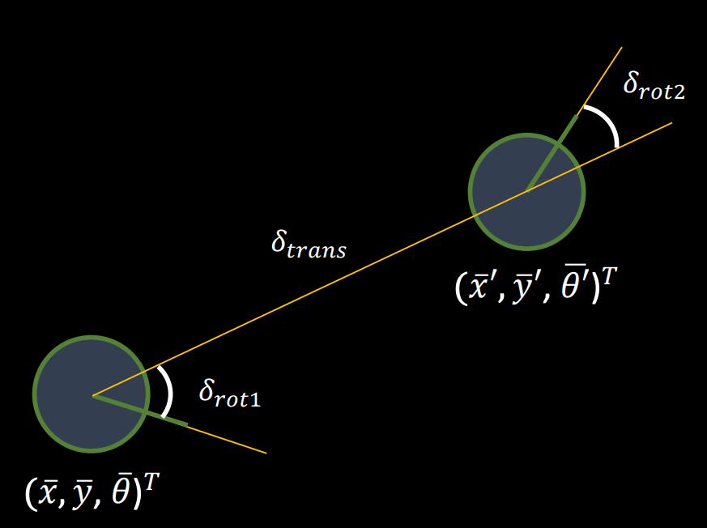

# Lab 11

## Summary

In this lab, I explored ways to implement grid localization for the robot in a
virtual, simulated environment using a Bayes filter. It required implementing
the odometry motion model for updating the car's estimated location in an
iterative fashion. Using the continuously updating knowledge of the prior
(belief), I was able to successfully implement the localization algorithm for
the virtual robot.

## Procedure

This lab was heavily code-oriented and required a thorough understanding of the
theory behind localization using a Bayes filter. As such, I will cover each
section of code separately and try to give an explanation for each function.

### Computing the control

```python
def compute_control(cur_pose, prev_pose):
    """ Given the current and previous odometry poses, this function extracts
    the control information based on the odometry motion model.

    Args:
        cur_pose  ([Pose]): Current Pose
        prev_pose ([Pose]): Previous Pose

    Returns:
        [delta_rot_1]: Rotation 1  (degrees)
        [delta_trans]: Translation (meters)
        [delta_rot_2]: Rotation 2  (degrees)
    """
    cur_x, cur_y, cur_yaw = cur_pose
    prev_x, prev_y, prev_yaw = prev_pose
    delta_x = cur_x - prev_x
    delta_y = cur_y - prev_y

    delta_rot_1 = mapper.normalize_angle(np.degrees(np.arctan2(delta_y, delta_x) - prev_yaw))
    delta_trans = ((delta_y ** 2) + (delta_x ** 2)) ** 0.5
    delta_rot_2 = mapper.normalize_angle(np.degrees(cur_yaw - prev_yaw - delta_rot_1))

    return delta_rot_1, delta_trans, delta_rot_2
```

To compute the control, I had to unpack the current and previous poses to work
with the x, y, and angle information separately. From there, it was a simple
matter of following the odometry motion model equation for the delta values.

One thing to note is that the equations implicitly assume a valid degree within
one full rotation of the circle. Thanks to the `normalize_angle()` function
given in the starter code, this was a simple matter of calling it on the angle
values.

<p align="center">
  
</p>

### Odometry motion model

```python
def odom_motion_model(cur_pose, prev_pose, u):
    """ Odometry Motion Model

    Args:
        cur_pose  ([Pose]): Current Pose
        prev_pose ([Pose]): Previous Pose
        (rot1, trans, rot2) (float, float, float): A tuple with control data in the format
                                                   format (rot1, trans, rot2) with units (degrees, meters, degrees)


    Returns:
        prob [float]: Probability p(x'|x, u)
    """
    actual_rot1, actual_trans, actual_rot2 = compute_control(cur_pose, prev_pose)
    proposed_rot1, proposed_trans, proposed_rot2 = u

    p1 = loc.gaussian(proposed_rot1, actual_rot1, loc.odom_rot_sigma)
    p2 = loc.gaussian(proposed_trans, actual_trans, loc.odom_trans_sigma)
    p3 = loc.gaussian(proposed_rot2, actual_rot2, loc.odom_rot_sigma)

    return p1 * p2 * p3
```

This was, again, mostly following the given equations in the notes for the
odometry motion model. One thing to note was that we had to incorporate
measurement noise in the control model, as the odometry information may not
always be spot on. To model this, we used Gaussian distributions for each value
of the rotation and translation. We used given values for the standard
deviations of the angles and x-y values.

### Prediction step

```python
def prediction_step(cur_odom, prev_odom):
    """ Prediction step of the Bayes Filter.
    Update the probabilities in loc.bel_bar based on loc.bel from the previous time step and the odometry motion model.

    Args:
        cur_odom  ([Pose]): Current Pose
        prev_odom ([Pose]): Previous Pose
    """
    u = compute_control(cur_odom, prev_odom)

    max_X = mapper.MAX_CELLS_X
    max_Y = mapper.MAX_CELLS_Y
    max_A = mapper.MAX_CELLS_A
    for x in range(max_X):
        for y in range(max_Y):
            for a in range(max_A):
                if (loc.bel[x][y][a] > 0.0001):
                    coords_before = mapper.from_map(x, y, a)
                    for xx in range(max_X):
                        for yy in range(max_Y):
                            for aa in range(max_A):
                                coords_now = mapper.from_map(xx, yy, aa)
                                p = odom_motion_model(coords_now, coords_before, u)
                                bel_p = loc.bel[x][y][a]
                                loc.bel_bar[xx][yy][aa] += p * bel_p

    # Normalize the bel bar
    loc.bel_bar = loc.bel_bar / np.sum(loc.bel_bar)
```

The prediction step required calculating the probability that the robot was in a
given spot in the grid. Each position in the grid corresponds to a specific
position and orientation (x, y, and angle) of the grid. However, this takes an
incredibly long time in both theoretical (big O) and practical scenarios. One
neat optimization to save a lot of computation time is only updating the
probability predictions if the belief is greater than a certain threshold. For
this, I used 0.01% as suggested by the lab handout, which was a subtle but
significant update to the algorithm. After computing the poses for the current
and previous iterations, the odometry motion model was applied iteratively to
each grid probability.

Finally, the beliefs were normalized to 1. This was necessary because of the
simple filter step in the for loop that allowed us to reduce computation time,
which made the probabilities sum to less than 1.

### Sensor model

```python
def sensor_model(obs):
    """ This is the equivalent of p(z|x).


    Args:
        obs ([ndarray]): A 1D array consisting of the measurements made in rotation loop

    Returns:
        [ndarray]: Returns a 1D array of size 18 (=loc.OBS_PER_CELL) with the likelihood of each individual measurements
    """
    prob_array = []
    for o in range(len(obs)):
        prob_array.append(loc.gaussian(loc.obs_range_data[o], obs[o], loc.sensor_sigma))

    return prob_array
```

This was a simple abstraction of the Bayes filter's update step, which requires
computing the probability of the sensor measurement given the pose. Again, using
Gaussians to model noise in the observations, the probability of each
orientation was computed and returned.

### Update step

```python
def update_step():
    """ Update step of the Bayes Filter.
    Update the probabilities in loc.bel based on loc.bel_bar and the sensor model.
    """
    max_X = mapper.MAX_CELLS_X
    max_Y = mapper.MAX_CELLS_Y
    max_A = mapper.MAX_CELLS_A

    # current dimensions
    for x in range(max_X):
        for y in range(max_Y):
            for a in range(max_A):
                loc.bel[x][y][a] = loc.bel_bar[x][y][a] * np.prod(sensor_model(mapper.get_views(x, y, a)))

    loc.bel = loc.bel / np.sum(loc.bel)
```

Finally, the update step. This step updates the probabilities of the belief
using the `bel_bar` (which represents the intermediate belief calculation in the
Bayes filter algorithm) and the sensor model information from the previous step.
Since the sensor model is a 1D array, each element was multiplied to produce the
overall probability.

### Putting it all together

Here's everything together, running the planned trajectory, and seeing the robot
localize on its own in the grid:

<p align="center">
    <iframe width="90%" src="https://www.youtube.com/embed/Nb5zs2KzbuM" title="YouTube video player" frameborder="0" allow="accelerometer; autoplay; clipboard-write; encrypted-media; gyroscope; picture-in-picture" allowfullscreen></iframe>
</p>

As you can see, there are three paths on the graph. The red path represents the
noisy odometry values, which are far off the robot's path as expected. The green
path is the ground truth value of the robot, which is conveniently given to us.
The blue path represents the belief at each iteration, which is relatively close
to the green path. This is good, because it means our Bayes filter is working!

However, that is not to say that the Bayes filter is perfect. At the bottom is
the output from running the Bayes filter, which shows the most probable state at
each step in the iteration. At the start, the filter puts too much emphasis on
the control, which can lead (as in this case) to overshoot. In other cases,
where the probabilities are uniformly distributed with minimal probabilities
everywhere in the grid, the chance of it being wrong is obviously higher than
when there is a higher confidence in the grid.

## Conclusion

This was a fun lab to interactively understand how the Bayes filter works to
help localize the robot. It was purely code-based which was a relief to my
broken robot :( Overall, the lab was a success.

## References

- [Lab handout](https://cei-lab.github.io/ECE4960-2022/Lab11.html)
- [Odometry
  lecture](https://cei-lab.github.io/ECE4960-2022/lectures/FastRobots-18-BayesFilter1_Motion_models.pdf)

```
----------------- 0 -----------------
2022-05-02 12:54:01,677 | INFO     |: ---------- PREDICTION STATS -----------
2022-05-02 12:54:01,692 | INFO     |: GT index         : (6, 3, 6)
2022-05-02 12:54:01,695 | INFO     |: Prior Bel index  : (3, 1, 7) with prob = 0.0498326
2022-05-02 12:54:01,698 | INFO     |: POS ERROR        : (0.867, 0.833, -10.012)
2022-05-02 12:54:01,701 | INFO     |: ---------- PREDICTION STATS -----------
2022-05-02 12:54:04,883 | INFO     |: ---------- UPDATE STATS -----------
2022-05-02 12:54:04,892 | INFO     |: GT index      : (6, 3, 6)
2022-05-02 12:54:04,894 | INFO     |: Bel index     : (6, 4, 6) with prob = 1.0
2022-05-02 12:54:04,896 | INFO     |: Bel_bar prob at index = 3.8715212584549334e-05
2022-05-02 12:54:04,898 | INFO     |: GT            : (0.258, -0.081, 319.988)
2022-05-02 12:54:04,900 | INFO     |: Belief        : (0.305, 0.000, -50.000)
2022-05-02 12:54:04,901 | INFO     |: POS ERROR     : (-0.047, -0.081, 369.988)
2022-05-02 12:54:04,902 | INFO     |: ---------- UPDATE STATS -----------
-------------------------------------


----------------- 1 -----------------
2022-05-02 12:54:07,030 | INFO     |: ---------- PREDICTION STATS -----------
2022-05-02 12:54:07,043 | INFO     |: GT index         : (7, 2, 5)
2022-05-02 12:54:07,044 | INFO     |: Prior Bel index  : (4, 4, 3) with prob = 0.0730563
2022-05-02 12:54:07,046 | INFO     |: POS ERROR        : (0.790, -0.526, 407.070)
2022-05-02 12:54:07,048 | INFO     |: ---------- PREDICTION STATS -----------
2022-05-02 12:54:10,251 | INFO     |: ---------- UPDATE STATS -----------
2022-05-02 12:54:10,258 | INFO     |: GT index      : (7, 2, 5)
2022-05-02 12:54:10,260 | INFO     |: Bel index     : (6, 2, 5) with prob = 1.0
2022-05-02 12:54:10,262 | INFO     |: Bel_bar prob at index = 5.665782119359946e-06
2022-05-02 12:54:10,263 | INFO     |: GT            : (0.485, -0.526, 657.070)
2022-05-02 12:54:10,264 | INFO     |: Belief        : (0.305, -0.610, -70.000)
2022-05-02 12:54:10,266 | INFO     |: POS ERROR     : (0.180, 0.083, 727.070)
2022-05-02 12:54:10,269 | INFO     |: ---------- UPDATE STATS -----------
-------------------------------------


----------------- 2 -----------------
2022-05-02 12:54:11,506 | INFO     |: ---------- PREDICTION STATS -----------
2022-05-02 12:54:11,516 | INFO     |: GT index         : (7, 2, 4)
2022-05-02 12:54:11,517 | INFO     |: Prior Bel index  : (7, 0, 9) with prob = 0.1248982
2022-05-02 12:54:11,518 | INFO     |: POS ERROR        : (-0.125, 0.693, 624.914)
2022-05-02 12:54:11,520 | INFO     |: ---------- PREDICTION STATS -----------
2022-05-02 12:54:14,691 | INFO     |: ---------- UPDATE STATS -----------
2022-05-02 12:54:14,697 | INFO     |: GT index      : (7, 2, 4)
2022-05-02 12:54:14,698 | INFO     |: Bel index     : (6, 2, 4) with prob = 1.0
2022-05-02 12:54:14,699 | INFO     |: Bel_bar prob at index = 2.358151240942949e-06
2022-05-02 12:54:14,700 | INFO     |: GT            : (0.485, -0.526, 994.914)
2022-05-02 12:54:14,702 | INFO     |: Belief        : (0.305, -0.610, -90.000)
2022-05-02 12:54:14,704 | INFO     |: POS ERROR     : (0.180, 0.083, 1084.914)
2022-05-02 12:54:14,705 | INFO     |: ---------- UPDATE STATS -----------
-------------------------------------


----------------- 3 -----------------
2022-05-02 12:54:15,835 | INFO     |: ---------- PREDICTION STATS -----------
2022-05-02 12:54:15,853 | INFO     |: GT index         : (7, 0, 4)
2022-05-02 12:54:15,854 | INFO     |: Prior Bel index  : (5, 3, 3) with prob = 0.0989562
2022-05-02 12:54:15,855 | INFO     |: POS ERROR        : (0.519, -0.620, 1104.914)
2022-05-02 12:54:15,857 | INFO     |: ---------- PREDICTION STATS -----------
2022-05-02 12:54:19,054 | INFO     |: ---------- UPDATE STATS -----------
2022-05-02 12:54:19,068 | INFO     |: GT index      : (7, 0, 4)
2022-05-02 12:54:19,069 | INFO     |: Bel index     : (6, 1, 4) with prob = 0.9999999
2022-05-02 12:54:19,071 | INFO     |: Bel_bar prob at index = 1.7546936124598518e-07
2022-05-02 12:54:19,072 | INFO     |: GT            : (0.519, -0.925, 1354.914)
2022-05-02 12:54:19,074 | INFO     |: Belief        : (0.305, -0.914, -90.000)
2022-05-02 12:54:19,075 | INFO     |: POS ERROR     : (0.215, -0.010, 1444.914)
2022-05-02 12:54:19,082 | INFO     |: ---------- UPDATE STATS -----------
-------------------------------------


----------------- 4 -----------------
2022-05-02 12:54:22,250 | INFO     |: ---------- PREDICTION STATS -----------
2022-05-02 12:54:22,269 | INFO     |: GT index         : (8, 0, 9)
2022-05-02 12:54:22,270 | INFO     |: Prior Bel index  : (6, 2, 7) with prob = 0.1456163
2022-05-02 12:54:22,271 | INFO     |: POS ERROR        : (0.480, -0.455, 1470.857)
2022-05-02 12:54:22,274 | INFO     |: ---------- PREDICTION STATS -----------
2022-05-02 12:54:25,436 | INFO     |: ---------- UPDATE STATS -----------
2022-05-02 12:54:25,445 | INFO     |: GT index      : (8, 0, 9)
2022-05-02 12:54:25,446 | INFO     |: Bel index     : (8, 1, 9) with prob = 1.0
2022-05-02 12:54:25,447 | INFO     |: Bel_bar prob at index = 1.0113273438174083e-07
2022-05-02 12:54:25,448 | INFO     |: GT            : (0.785, -1.065, 1800.857)
2022-05-02 12:54:25,450 | INFO     |: Belief        : (0.914, -0.914, 10.000)
2022-05-02 12:54:25,451 | INFO     |: POS ERROR     : (-0.130, -0.150, 1790.857)
2022-05-02 12:54:25,454 | INFO     |: ---------- UPDATE STATS -----------
-------------------------------------


----------------- 5 -----------------
2022-05-02 12:54:31,561 | INFO     |: ---------- PREDICTION STATS -----------
2022-05-02 12:54:31,573 | INFO     |: GT index         : (11, 1, 11)
2022-05-02 12:54:31,574 | INFO     |: Prior Bel index  : (8, 3, 16) with prob = 0.0536262
2022-05-02 12:54:31,575 | INFO     |: POS ERROR        : (0.646, -0.593, 1699.948)
2022-05-02 12:54:31,577 | INFO     |: ---------- PREDICTION STATS -----------
2022-05-02 12:54:35,026 | INFO     |: ---------- UPDATE STATS -----------
2022-05-02 12:54:35,046 | INFO     |: GT index      : (11, 1, 11)
2022-05-02 12:54:35,051 | INFO     |: Bel index     : (10, 1, 11) with prob = 1.0
2022-05-02 12:54:35,053 | INFO     |: Bel_bar prob at index = 2.1504420941955985e-09
2022-05-02 12:54:35,056 | INFO     |: GT            : (1.560, -0.898, 2209.948)
2022-05-02 12:54:35,067 | INFO     |: Belief        : (1.524, -0.914, 50.000)
2022-05-02 12:54:35,071 | INFO     |: POS ERROR     : (0.036, 0.016, 2159.948)
2022-05-02 12:54:35,076 | INFO     |: ---------- UPDATE STATS -----------
-------------------------------------


----------------- 6 -----------------
2022-05-02 12:54:37,347 | INFO     |: ---------- PREDICTION STATS -----------
2022-05-02 12:54:37,360 | INFO     |: GT index         : (11, 2, 12)
2022-05-02 12:54:37,363 | INFO     |: Prior Bel index  : (11, 0, 12) with prob = 0.1977574
2022-05-02 12:54:37,365 | INFO     |: POS ERROR        : (-0.193, 0.714, 2169.079)
2022-05-02 12:54:37,367 | INFO     |: ---------- PREDICTION STATS -----------
2022-05-02 12:54:40,552 | INFO     |: ---------- UPDATE STATS -----------
2022-05-02 12:54:40,561 | INFO     |: GT index      : (11, 2, 12)
2022-05-02 12:54:40,562 | INFO     |: Bel index     : (10, 2, 12) with prob = 1.0
2022-05-02 12:54:40,563 | INFO     |: Bel_bar prob at index = 9.096876731073805e-10
2022-05-02 12:54:40,565 | INFO     |: GT            : (1.636, -0.505, 2599.079)
2022-05-02 12:54:40,566 | INFO     |: Belief        : (1.524, -0.610, 70.000)
2022-05-02 12:54:40,567 | INFO     |: POS ERROR     : (0.112, 0.104, 2529.079)
2022-05-02 12:54:40,569 | INFO     |: ---------- UPDATE STATS -----------
-------------------------------------


----------------- 7 -----------------
2022-05-02 12:54:42,715 | INFO     |: ---------- PREDICTION STATS -----------
2022-05-02 12:54:42,728 | INFO     |: GT index         : (11, 3, 13)
2022-05-02 12:54:42,729 | INFO     |: Prior Bel index  : (9, 3, 1) with prob = 0.1358190
2022-05-02 12:54:42,730 | INFO     |: POS ERROR        : (0.486, 0.159, 2754.810)
2022-05-02 12:54:42,732 | INFO     |: ---------- PREDICTION STATS -----------
2022-05-02 12:54:45,860 | INFO     |: ---------- UPDATE STATS -----------
2022-05-02 12:54:45,863 | INFO     |: GT index      : (11, 3, 13)
2022-05-02 12:54:45,864 | INFO     |: Bel index     : (11, 3, 13) with prob = 1.0
2022-05-02 12:54:45,866 | INFO     |: Bel_bar prob at index = 1.8613943254883015e-10
2022-05-02 12:54:45,867 | INFO     |: GT            : (1.705, -0.146, 2964.810)
2022-05-02 12:54:45,868 | INFO     |: Belief        : (1.829, -0.305, 90.000)
2022-05-02 12:54:45,869 | INFO     |: POS ERROR     : (-0.123, 0.159, 2874.810)
2022-05-02 12:54:45,870 | INFO     |: ---------- UPDATE STATS -----------
-------------------------------------


----------------- 8 -----------------
2022-05-02 12:54:48,995 | INFO     |: ---------- PREDICTION STATS -----------
2022-05-02 12:54:49,003 | INFO     |: GT index         : (11, 5, 14)
2022-05-02 12:54:49,004 | INFO     |: Prior Bel index  : (10, 0, 8) with prob = 0.0972377
2022-05-02 12:54:49,006 | INFO     |: POS ERROR        : (0.176, 1.548, 2995.536)
2022-05-02 12:54:49,009 | INFO     |: ---------- PREDICTION STATS -----------
2022-05-02 12:54:52,263 | INFO     |: ---------- UPDATE STATS -----------
2022-05-02 12:54:52,278 | INFO     |: GT index      : (11, 5, 14)
2022-05-02 12:54:52,281 | INFO     |: Bel index     : (9, 6, 9) with prob = 0.9168151
2022-05-02 12:54:52,286 | INFO     |: Bel_bar prob at index = 3.0571928617564546e-11
2022-05-02 12:54:52,289 | INFO     |: GT            : (1.700, 0.329, 3345.536)
2022-05-02 12:54:52,305 | INFO     |: Belief        : (1.219, 0.610, 10.000)
2022-05-02 12:54:52,307 | INFO     |: POS ERROR     : (0.481, -0.281, 3335.536)
2022-05-02 12:54:52,316 | INFO     |: ---------- UPDATE STATS -----------
-------------------------------------


----------------- 9 -----------------
2022-05-02 12:54:55,544 | INFO     |: ---------- PREDICTION STATS -----------
2022-05-02 12:54:55,555 | INFO     |: GT index         : (11, 6, 16)
2022-05-02 12:54:55,556 | INFO     |: Prior Bel index  : (10, 6, 13) with prob = 0.1173683
2022-05-02 12:54:55,557 | INFO     |: POS ERROR        : (0.179, 0.055, 3296.785)
2022-05-02 12:54:55,559 | INFO     |: ---------- PREDICTION STATS -----------
2022-05-02 12:54:59,160 | INFO     |: ---------- UPDATE STATS -----------
2022-05-02 12:54:59,177 | INFO     |: GT index      : (11, 6, 16)
2022-05-02 12:54:59,188 | INFO     |: Bel index     : (10, 6, 16) with prob = 1.0
2022-05-02 12:54:59,192 | INFO     |: Bel_bar prob at index = 4.223349219277405e-12
2022-05-02 12:54:59,201 | INFO     |: GT            : (1.703, 0.665, 3746.785)
2022-05-02 12:54:59,221 | INFO     |: Belief        : (1.524, 0.610, 150.000)
2022-05-02 12:54:59,236 | INFO     |: POS ERROR     : (0.179, 0.055, 3596.785)
2022-05-02 12:54:59,282 | INFO     |: ---------- UPDATE STATS -----------
-------------------------------------


----------------- 10 -----------------
2022-05-02 12:55:01,554 | INFO     |: ---------- PREDICTION STATS -----------
2022-05-02 12:55:01,572 | INFO     |: GT index         : (10, 7, 16)
2022-05-02 12:55:01,573 | INFO     |: Prior Bel index  : (11, 6, 1) with prob = 0.1201912
2022-05-02 12:55:01,576 | INFO     |: POS ERROR        : (-0.551, 0.333, 3908.247)
2022-05-02 12:55:01,581 | INFO     |: ---------- PREDICTION STATS -----------
2022-05-02 12:55:04,877 | INFO     |: ---------- UPDATE STATS -----------
2022-05-02 12:55:04,894 | INFO     |: GT index      : (10, 7, 16)
2022-05-02 12:55:04,895 | INFO     |: Bel index     : (9, 7, 16) with prob = 1.0
2022-05-02 12:55:04,898 | INFO     |: Bel_bar prob at index = 5.9363312681707525e-09
2022-05-02 12:55:04,901 | INFO     |: GT            : (1.278, 0.943, 4118.247)
2022-05-02 12:55:04,903 | INFO     |: Belief        : (1.219, 0.914, 150.000)
2022-05-02 12:55:04,904 | INFO     |: POS ERROR     : (0.059, 0.029, 3968.247)
2022-05-02 12:55:04,905 | INFO     |: ---------- UPDATE STATS -----------
-------------------------------------


----------------- 11 -----------------
2022-05-02 12:55:08,039 | INFO     |: ---------- PREDICTION STATS -----------
2022-05-02 12:55:08,051 | INFO     |: GT index         : (7, 6, 3)
2022-05-02 12:55:08,052 | INFO     |: Prior Bel index  : (11, 8, 17) with prob = 0.1546275
2022-05-02 12:55:08,053 | INFO     |: POS ERROR        : (-1.449, -0.339, 4042.767)
2022-05-02 12:55:08,055 | INFO     |: ---------- PREDICTION STATS -----------
2022-05-02 12:55:11,265 | INFO     |: ---------- UPDATE STATS -----------
2022-05-02 12:55:11,272 | INFO     |: GT index      : (7, 6, 3)
2022-05-02 12:55:11,273 | INFO     |: Bel index     : (7, 7, 3) with prob = 1.0
2022-05-02 12:55:11,274 | INFO     |: Bel_bar prob at index = 4.0766948301812504e-08
2022-05-02 12:55:11,275 | INFO     |: GT            : (0.380, 0.880, 4572.767)
2022-05-02 12:55:11,276 | INFO     |: Belief        : (0.610, 0.914, -110.000)
2022-05-02 12:55:11,278 | INFO     |: POS ERROR     : (-0.229, -0.035, 4682.767)
2022-05-02 12:55:11,279 | INFO     |: ---------- UPDATE STATS -----------
-------------------------------------


----------------- 12 -----------------
2022-05-02 12:55:14,324 | INFO     |: ---------- PREDICTION STATS -----------
2022-05-02 12:55:14,334 | INFO     |: GT index         : (6, 4, 5)
2022-05-02 12:55:14,335 | INFO     |: Prior Bel index  : (8, 8, 6) with prob = 0.1726721
2022-05-02 12:55:14,337 | INFO     |: POS ERROR        : (-0.724, -0.950, 4664.793)
2022-05-02 12:55:14,339 | INFO     |: ---------- PREDICTION STATS -----------
2022-05-02 12:55:17,545 | INFO     |: ---------- UPDATE STATS -----------
2022-05-02 12:55:17,548 | INFO     |: GT index      : (6, 4, 5)
2022-05-02 12:55:17,549 | INFO     |: Bel index     : (6, 5, 5) with prob = 1.0
2022-05-02 12:55:17,550 | INFO     |: Bel_bar prob at index = 3.8593231924662243e-13
2022-05-02 12:55:17,553 | INFO     |: GT            : (0.191, 0.269, 4974.793)
2022-05-02 12:55:17,554 | INFO     |: Belief        : (0.305, 0.305, -70.000)
2022-05-02 12:55:17,555 | INFO     |: POS ERROR     : (-0.114, -0.035, 5044.793)
2022-05-02 12:55:17,557 | INFO     |: ---------- UPDATE STATS -----------
-------------------------------------


----------------- 13 -----------------
2022-05-02 12:55:19,687 | INFO     |: ---------- PREDICTION STATS -----------
2022-05-02 12:55:19,697 | INFO     |: GT index         : (5, 3, 2)
2022-05-02 12:55:19,698 | INFO     |: Prior Bel index  : (4, 2, 15) with prob = 0.0619652
2022-05-02 12:55:19,699 | INFO     |: POS ERROR        : (0.218, 0.591, 4776.050)
2022-05-02 12:55:19,701 | INFO     |: ---------- PREDICTION STATS -----------
2022-05-02 12:55:22,940 | INFO     |: ---------- UPDATE STATS -----------
2022-05-02 12:55:22,950 | INFO     |: GT index      : (5, 3, 2)
2022-05-02 12:55:22,952 | INFO     |: Bel index     : (5, 3, 2) with prob = 0.9999797
2022-05-02 12:55:22,953 | INFO     |: Bel_bar prob at index = 3.723013587822488e-11
2022-05-02 12:55:22,955 | INFO     |: GT            : (-0.087, -0.019, 5266.050)
2022-05-02 12:55:22,957 | INFO     |: Belief        : (0.000, -0.305, -130.000)
2022-05-02 12:55:22,958 | INFO     |: POS ERROR     : (-0.087, 0.286, 5396.050)
2022-05-02 12:55:22,960 | INFO     |: ---------- UPDATE STATS -----------
-------------------------------------


----------------- 14 -----------------
2022-05-02 12:55:26,120 | INFO     |: ---------- PREDICTION STATS -----------
2022-05-02 12:55:26,133 | INFO     |: GT index         : (4, 3, 1)
2022-05-02 12:55:26,134 | INFO     |: Prior Bel index  : (3, 2, 13) with prob = 0.0973293
2022-05-02 12:55:26,136 | INFO     |: POS ERROR        : (0.141, 0.471, 5152.364)
2022-05-02 12:55:26,137 | INFO     |: ---------- PREDICTION STATS -----------
2022-05-02 12:55:29,306 | INFO     |: ---------- UPDATE STATS -----------
2022-05-02 12:55:29,321 | INFO     |: GT index      : (4, 3, 1)
2022-05-02 12:55:29,322 | INFO     |: Bel index     : (4, 3, 1) with prob = 1.0
2022-05-02 12:55:29,324 | INFO     |: Bel_bar prob at index = 0.016713035688536784
2022-05-02 12:55:29,325 | INFO     |: GT            : (-0.469, -0.138, 5602.365)
2022-05-02 12:55:29,326 | INFO     |: Belief        : (-0.305, -0.305, -150.000)
2022-05-02 12:55:29,328 | INFO     |: POS ERROR     : (-0.164, 0.167, 5752.365)
2022-05-02 12:55:29,330 | INFO     |: ---------- UPDATE STATS -----------
-------------------------------------


----------------- 15 -----------------
2022-05-02 12:55:32,547 | INFO     |: ---------- PREDICTION STATS -----------
2022-05-02 12:55:32,559 | INFO     |: GT index         : (3, 3, 17)
2022-05-02 12:55:32,562 | INFO     |: Prior Bel index  : (5, 1, 12) with prob = 0.1012223
2022-05-02 12:55:32,565 | INFO     |: POS ERROR        : (-0.866, 0.823, 5508.964)
2022-05-02 12:55:32,569 | INFO     |: ---------- PREDICTION STATS -----------
2022-05-02 12:55:35,731 | INFO     |: ---------- UPDATE STATS -----------
2022-05-02 12:55:35,743 | INFO     |: GT index      : (3, 3, 17)
2022-05-02 12:55:35,744 | INFO     |: Bel index     : (2, 3, 0) with prob = 1.0
2022-05-02 12:55:35,746 | INFO     |: Bel_bar prob at index = 0.00010008713893707177
2022-05-02 12:55:35,747 | INFO     |: GT            : (-0.866, -0.091, 5938.964)
2022-05-02 12:55:35,748 | INFO     |: Belief        : (-0.914, -0.305, -170.000)
2022-05-02 12:55:35,749 | INFO     |: POS ERROR     : (0.049, 0.214, 6108.964)
2022-05-02 12:55:35,750 | INFO     |: ---------- UPDATE STATS -----------
-------------------------------------
```

[Back to main](../index.md)
