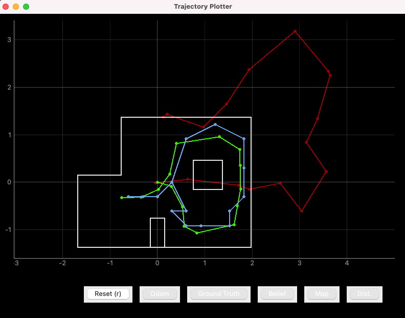
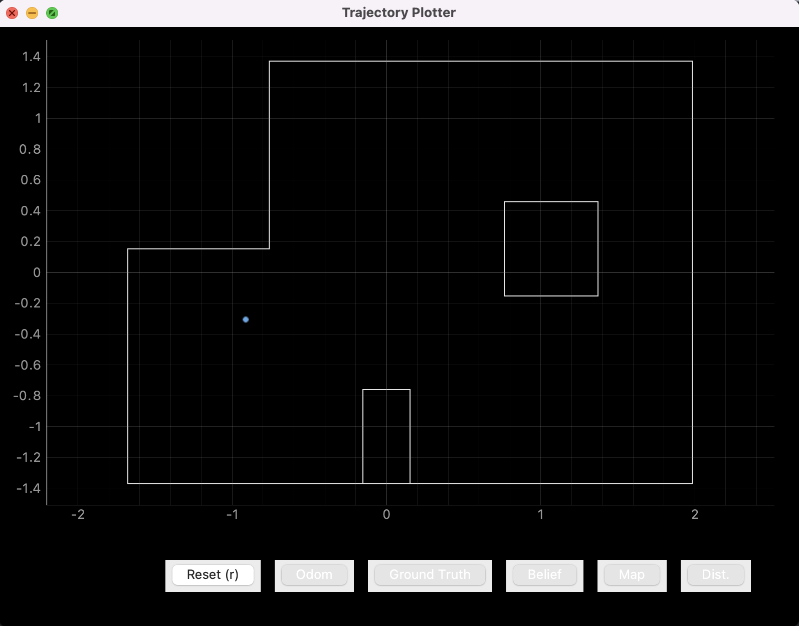
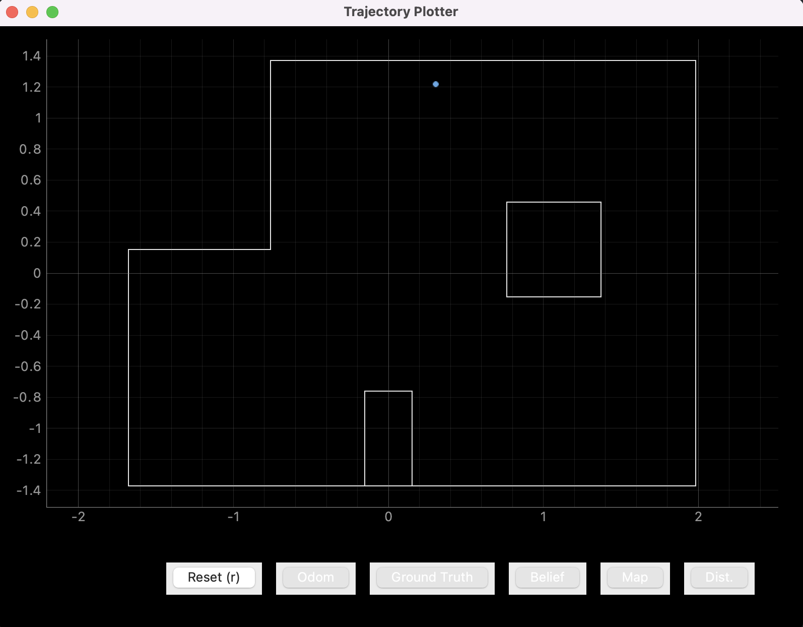
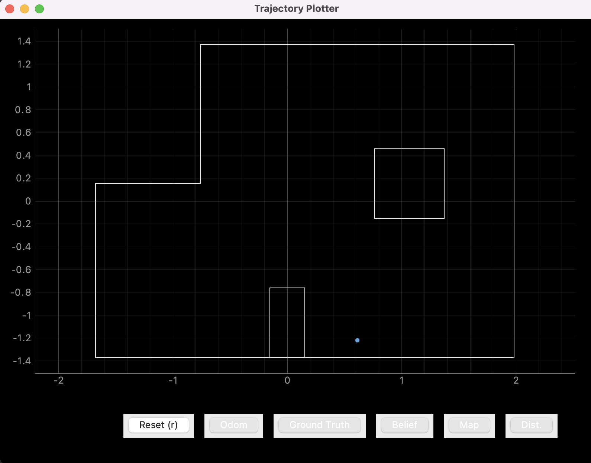

# Lab 12

## Summary

The goal of this lab is to perform localization on the real robot using the code
we used in [Lab 11](../11/index.md). Even though localization works well in
simulation, that isn't necessarily the guarantee with real-world robotic
systems, and this turned out to be the case with our robot, as we will see with
this lab.

## Procedure

To perform localization, we need to use a Bayes filter algorithm and compute the
probability that the robot is located in a specific spot in the map grid. Using
the map of the lab space that was generated for us by the course staff, as well
as the Bayes filter implementation that was checked by the staff after Lab 11, I
needed to put the two together to confirm that localization works as intended in
simulation.

### Test localization in simulation

To begin, I used the update step for the Bayes filter in simulation to run the
trajectory from the previous lab. It worked pretty well, as evident by the blue
and green lines matching relatively closely. This was expected for simulation,
as we had seen in last week's lab.

<p align="center">
    
</p>

### Running the update step on the real robot

In order to run the update step on the real robot, the robot had to localize by
spinning in place to gather distance data, for which the code is shown below:

```python
def perform_observation_loop(self, rot_vel=120):
    # Initialize my custom robot controller class
    rc = RobotControl(ble)

    # Spin in place with PWM = 95, collecting sensor data
    rc.spin_360(95)

    # We need to explicitly stop recording data after it stops spinning
    while rc.sensor_readings is None or len(rc.sensor_readings) <= 18:
        asyncio.run(asyncio.sleep(0.05))
    rc.stop_recording()

    # Display the full sensor data
    cols = [
        "time", "dist_r", "dist_f", "acc_x", "acc_y", "acc_z", "gyr_x",
        "gyr_y", "gyr_z", "mag_x", "mag_y", "mag_z", "temp"
    ]
    sensor_data = pd.DataFrame(rc.sensor_arr, columns=cols)

    # We only really care about the front ToF data though:
    sensor_ranges = (np.flip(sensor_data["dist_f"][:18].to_numpy()))[np.newaxis].T

    # Convert millimeters to meters
    sensor_ranges /= 1000

    return sensor_ranges, sensor_ranges  # We don't care about the second value
```

This allowed us to use the ToF sensor data to predict where the robot was at
each step. Here are the results from the four marked poses in the lab:

<p align="center">
    
</p>

This first pose (-3, -2, 0) ended up being really close to the actual pose of
the robot.

(Something not evident in these images is the angle of the robot. However,
thankfully for us, all the angles lined up exactly with the direction the robot
was facing.)

<p align="center">
    
</p>

The second pose (0, 3, 0) also ended up being quite good.

<p align="center">
    
</p>

The third pose (5, -3, 0) was the first pose that the localization did not do a
good job on. From the ground truth, it was about 3 feet away, which is quite a
big error from the actual pose. My guess is that the update step got confused by
the box in the middle, and the probability ended up being around 80%. This can
happen from time to time, but as long as the localization works pretty well on
average, this shouldn't be a problem in the last lab, especially with the
predict step working with the update step.

<p align="center">
    
</p>

The last pose (5, 3, 0) worked well once again. Again, no problems here
thankfully.

## Conclusion

Overall, the localization was spot on for the most part, which means we will be
relying on it for the final lab of the year, where we will have to execute path
planning to traverse waypoints in the map!

## References

- [Lab handout](https://cei-lab.github.io/ECE4960-2022/Lab12.html)

[Back to main](../index.md)
