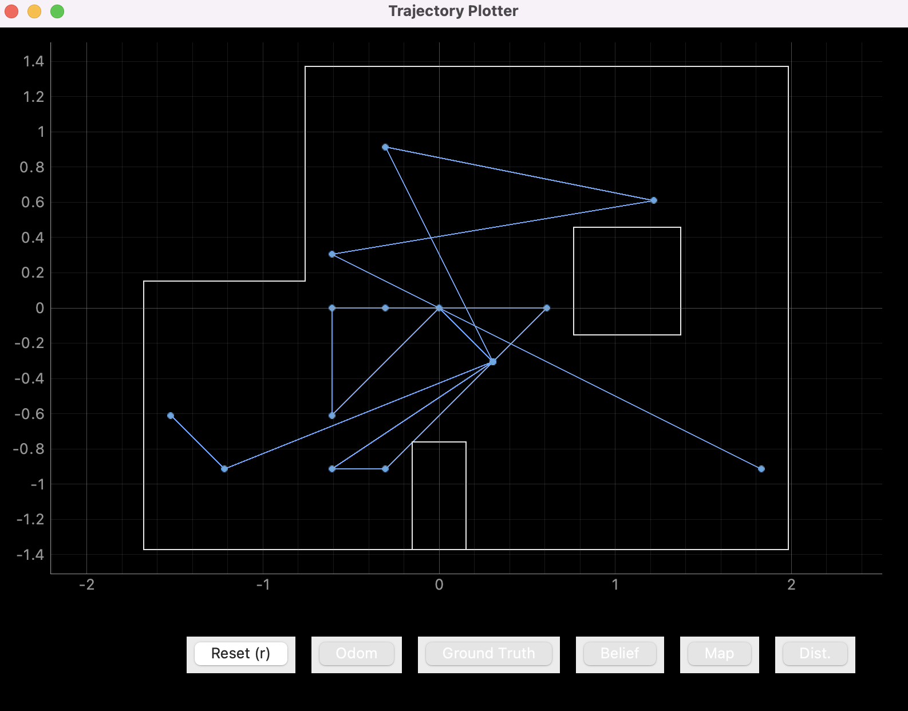

# Lab 13

## Summary

This is it... the final lab. Everything we've done so far... leading up to THIS
moment. The ultimate test of ability for our robot. Putting together the
localization, the Bayes filter, and potentially other pathfinding algorithms, my
goal in this lab was simple: enable the robot to drive from point to point, all
the way around a set of waypoints. Will we be able to complete this task to live
another day, or will all our work this semester have been for nothing... Read on
to find out!

## Collaborators

I collaborated with [Joey Horwitz](https://joeyhz.github.io/Fast-Robots/) and
[Jacob
Lashin](https://pages.github.coecis.cornell.edu/jwl266/Jacob-Lashin-4960-Project/)
for this lab.

## Procedure

The first step for this lab was to decide a strategy for localization, or more
specifically, whether to localize or not. Some groups opted to not localize at
all, but we decided to go for it, since it seemed to work well for the last lab.
(This turned out to be a questionable decision, as I will explain later.)

For localization, I opted for the standard "spin 360 degrees in place" strategy.
This was the path of least resistance when it came to migrating [Lab
12](../12/index.md) code into this lab. To make sure it worked as expected, we
ran the visualization in sync with the robot, and sure enough, the Bayes filter
seemed to work fine.

The next step was coming up with the path trajectory for the robot to follow.
This required a representation for the waypoints, which we were given in the lab
handout, but unfortunately, only the x and y coordinates were given, and in
feet. In other words, we had to write helper code to represent them in a format
that we wanted, which was in grid cell values:

```python
# Lab 13 waypoints (in grid cell units)
waypoints_in_ft = [
    (-4, -3, -135),  # First waypoint is the starting point. We decided to skip this
    (-2, -1, -180),
    (1, -1, -180),
    (2, -3, 120),
    (5, -3, -180),
    (5, -2, -90),
    (5, 3, -90),
    (0, 3, 0),
    (0, 0, 90),
]

# ft -> m
waypoints_in_m = []
for wp in waypoints_in_ft:
    waypoint = (wp[0] * 0.308, wp[1] * 0.308, wp[2])
    waypoints_in_m.append(waypoint)

# m -> [0][1][2]...[x]
waypoints = []
for wp in waypoints_in_m:
    waypoints.append(loc.mapper.to_map(*wp))
```

Now this is where things got challenging. To enable the robot to navigate to
these waypoints, it needs specific control input values. Fortunately, we have
the helper functions from [Lab 10](../10/index.md) that allows us to use the
odometry motion model. Not so fortunately, however, the control inputs need an
additional translation into motor values, since the control we compute are in
terms of how many feet to move and how many degrees to turn. For this, we
decided to opt for open-loop control; in other words, our robot's motor values
had to be hardcoded, which meant that, based on certain conditions like battery
charge, floor friction, and many other factors out of our control, we had to
cross our fingers and hope that our robot would turn the amounts we wanted.

Though this sounds like a terrible idea, it surprisingly ended up being okay.
Our problem was not translating the controls into motor inputs, because as long
as the motor inputs were approximately close enough, the robot would go towards
the waypoint and re-localize. Even if the robot missed the mark by a few units,
it would have another go at the waypoint until it reached close to the
destination.

This is a good segway into another consideration for path planning: obstacle
avoidance. Our algorithm is presented here:

```python
def avoid_obstacles():
    turn_left_90()
    while right_tof_dist < 300:
        if front_tof_dist < 300:
            avoid_obstacles()
        else:
            move_forward(60)
            sleep(0.2)
            stop()
    sleep(0.1)
    turn_right_90()
```

The algorithm is actually quite simple, yet effective. When the robot detects an
obstacle, it will call this function, which starts the process. First, it turns
counterclockwise 90 degrees, which means the right ToF sensor is now facing the
originally forward direction. Then, if there is no obstacle in front of the now
left-facing robot, it moves forward until the original obstacle on the right is
gone from near view. Then, it is free to rotate back clockwise 90 degrees to
face the original direction, and it resumes course where it left off.

There is, however, a slight catch. What if, while the obstacle avoidance
algorithm is running, it sees another obstacle? That is, on its originally left
side, there was a second obstacle. When such an obstacle comes into near view,
the robot recurses on the algorithm, meaning it calls itself again. This is a
nifty trick to allow the robot to retain a memory of sorts, in the sense that it
will pick up trying to avoid obstacles where it left off once the second
obstacle is gone from view. This can repeat infinitely many times (though it
shouldn't!), which means it will be able to remember its original course by the
end of the avoidance algorithm.

In theory, we thought it would work well, and it certainly did. We had very few
issues with running into walls, unless the speed was too high, which happened
rarely.

Now, to put it all together, here is our final pseudocode algorithm for the
whole shebang:

```python
waypoint_index = 0
while True:
    # Run the prediction step
    loc.prediction_step(current_odom, prev_odom)

    # Run localization
    loc.get_observation_data()

    # Run the update step to get the current belief
    loc.update_step()

    # Check if we reached a waypoint (or near enough)
    if wp_x - 1 <= x <= wp_x + 1 and wp_y - 1 <= y <= wp_y + 1:
        waypoint_index += 1

    # Termination condition - we reached the final waypoint!
    if i == len(waypoints):
        print("We outta here!")
        break

    # Compute the necessary control to get to the next waypoint (assuming no obstacles)
    delta_rot_1, delta_trans, delta_rot_2 = loc.compute_control(waypoints_in_m[i], current_belief)
    speed_rot_1, time_rot_1 = compute_motor_val(delta_rot_1)
    speed_trans, time_trans = compute_motor_val(delta_trans)
    speed_rot_2, time_rot_2 = compute_motor_val(delta_rot_2)

    # Invoke motor inputs...
    # First rotation:
    rotate(speed_rot_1)
    sleep(time_rot_1)
    stop()

    sleep(1)

    # Try to move forward with the forward controls.
    # If there are obstacles, scrap the rest of the control and try again with new localization data.
    obstacles_avoided = move_forward_safely(speed_trans, time_trans)
    if obstacles_avoided:
        continue

    sleep(1)

    # Otherwise... continue with the second rotation
    rotate(speed_rot_2)
    sleep(time_rot_2)
    stop()
```

Keep in mind this is just pseudocode, but hopefully it gets the idea across.
Continuously localize at every step, and compute a new set of controls to
execute. If there are obstacles, make sure avoid before the next step. If we are
near a waypoint, set the new goal as the next waypoint in the list. Once we hit
all the waypoints, we are done.

That's it! This is the full protocol for the path planning. Here is a video of
the robot in action:

<p align="center">
    <iframe width="90%" height="600" src="https://www.youtube.com/embed/hYqq_7ihHmY" title="YouTube video player" frameborder="0" allow="accelerometer; autoplay; clipboard-write; encrypted-media; gyroscope; picture-in-picture" allowfullscreen></iframe>
</p>

The problems...? Well, as you can see in the video, the localization did not
always do a complete 360. This turned out to be a pretty crucial point of
improvement, as that meant that our ToF distance data would be mapped to the
wrong angles, which would drastically reduce our localization accuracy. This
became an issue the longer the robot ran, as the battery would deplete as the
robot continually used its power without any pause. As such, with a poor
localization, the robot would act upon erroneous computed control values, which
would sometimes lead it to go to random places.

<p align="center">
    
</p>

However, aside from the localization affecting the whole algorithm, everything
else seemed to work out very well. If the localization was accurate, the robot
would send approximately the right control values to approach the waypoint, and
it seemed to make some progress at every step.

## Conclusion

Well... as you can see, we didn't quite get the robot to hit every single
waypoint. In other words, we were unable to get a perfect solution to the
problem. However, this lab was a limit test of what we could possibly do with
our robot given the time and money (quality of sensors and car) constraints, and
looking back at what we accomplished, we are very happy with our progress!

If there are a couple of things I would redo, had I another chance at this lab,
it would certainly be incorporating PID control into the 360 degrees observation
loop to better spin at regular intervals. With a better localization, we would
almost certainly have been able to complete the waypoints. Another thing that
would have saved us some time would be using PID control for the motor input
values. Instead of experimentally hardcoding PWM values and times for rotations
and forward translations, we could have relied on good ol' math.

## Afterword

ECE 4960 was a fun course and taught me a lot about robotics as a whole! Though
there were painful moments here and there with random wires breaking off,
debugging Arduino code and header files not linking for whatever reason, and my
robot eventually hitting the wall too hard one too many times to the point where
it was unusable, I still survived the course, with the generous help of all the
course staff, including but not limited to Vivek the TA who helped me with
almost 90% of my robot problems, and Prof. Kirstin Petersen for being super
accommodating and encouraging me when I felt like despairing because of all the
hardware issues out of my control. Shoutout to Jonathan's and Kirstin's robots
for coming in clutch even though my personal robot did not survive until the end
:( and a huge thank you to every student in the course who toiled and labored
countless hours with me inside and outside the lab, keeping me company and
answering any minor questions.

## References

- [Lab handout](https://cei-lab.github.io/ECE4960-2022/Lab13.html)

## Appendix: Bayes Filter Code Output

```
----------------WP 0 ----------------
2022-05-18 16:54:35,421 | INFO     |: Prediction Step
2022-05-18 16:54:35,504 | INFO     |:  | Prediction Time: 0.079 secs
[[2.793]
 [1.109]
 [1.046]
 [1.065]
 [1.089]
 [0.586]
 [0.439]
 [0.4  ]
 [0.428]
 [0.554]
 [0.451]
 [0.382]
 [0.389]
 [0.494]
 [0.785]
 [1.02 ]
 [3.561]
 [1.892]]
2022-05-18 16:54:46,917 | INFO     |: Update Step
2022-05-18 16:54:46,921 | INFO     |:      | Update Time: 0.003 secs
2022-05-18 16:54:46,922 | INFO     |: Bel index     : (1, 1, 11) with prob = 1.0
2022-05-18 16:54:46,923 | INFO     |: Bel_bar prob at index = 7.315639963206552e-09
2022-05-18 16:54:46,924 | INFO     |: Belief        : (-1.219, -0.914, 50.000)
Current belief: (-1.2191999999999998, -0.9144, 50.0)
Control values: -4.848424217331683, 0.8553193555625874, 134.84842421733168
Rotating right 100
Moving forward: 60 PWM
Rotating left 100
-------------------------------------


----------------WP 0 ----------------
2022-05-18 16:54:51,672 | INFO     |: Prediction Step
2022-05-18 16:54:51,719 | INFO     |:  | Prediction Time: 0.046 secs
[[1.142]
 [1.151]
 [0.847]
 [0.413]
 [0.323]
 [0.28 ]
 [0.291]
 [0.365]
 [0.318]
 [0.259]
 [0.235]
 [0.232]
 [2.523]
 [1.696]
 [2.858]
 [2.283]
 [1.737]
 [1.272]]
2022-05-18 16:55:01,933 | INFO     |: Update Step
2022-05-18 16:55:01,936 | INFO     |:      | Update Time: 0.003 secs
2022-05-18 16:55:01,937 | INFO     |: Bel index     : (3, 6, 10) with prob = 0.9999999
2022-05-18 16:55:01,938 | INFO     |: Bel_bar prob at index = 1.017330396250979e-05
2022-05-18 16:55:01,938 | INFO     |: Belief        : (-0.610, 0.610, 30.000)
Current belief: (-0.6095999999999998, 0.6096000000000003, 30.0)
Control values: -120.39961534756544, 0.9176223188218562, -89.60038465243456
Rotating right 102
Moving forward: 60 PWM


----------------WP 0 ----------------
2022-05-18 16:55:04,006 | INFO     |: Prediction Step
2022-05-18 16:55:04,050 | INFO     |:  | Prediction Time: 0.043 secs
[[3.703]
 [3.013]
 [1.297]
 [1.356]
 [1.492]
 [1.284]
 [1.177]
 [1.169]
 [0.818]
 [0.441]
 [0.35 ]
 [0.317]
 [0.332]
 [0.383]
 [0.304]
 [0.292]
 [0.227]
 [0.225]]
2022-05-18 16:55:13,891 | INFO     |: Update Step
2022-05-18 16:55:13,894 | INFO     |:      | Update Time: 0.003 secs
2022-05-18 16:55:13,895 | INFO     |: Bel index     : (9, 3, 17) with prob = 0.9999999
2022-05-18 16:55:13,896 | INFO     |: Bel_bar prob at index = 1.8522359652750974e-34
2022-05-18 16:55:13,897 | INFO     |: Belief        : (1.219, -0.305, 170.000)
Current belief: (1.2192000000000005, -0.30479999999999985, 170.0)
Control values: 10.099905355615533, 1.8352027898845407, -0.09990535561553315
Rotating left 102
Moving forward: 60 PWM
Rotating right 102
-------------------------------------


----------------WP 0 ----------------
2022-05-18 16:55:18,807 | INFO     |: Prediction Step
2022-05-18 16:55:18,852 | INFO     |:  | Prediction Time: 0.044 secs
[[1.179]
 [0.814]
 [0.688]
 [0.633]
 [0.927]
 [1.835]
 [2.311]
 [1.674]
 [1.252]
 [1.695]
 [2.057]
 [2.707]
 [0.845]
 [0.793]
 [0.787]
 [0.825]
 [2.854]
 [1.851]]
2022-05-18 16:55:29,302 | INFO     |: Update Step
2022-05-18 16:55:29,306 | INFO     |:      | Update Time: 0.004 secs
2022-05-18 16:55:29,308 | INFO     |: Bel index     : (5, 4, 14) with prob = 0.9992326
2022-05-18 16:55:29,309 | INFO     |: Bel_bar prob at index = 6.660099661621505e-06
2022-05-18 16:55:29,319 | INFO     |: Belief        : (0.000, 0.000, 110.000)
Current belief: (1.3877787807814457e-16, 1.3877787807814457e-16, 110.0)
Control values: 96.56505117707798, 0.6887089370699354, -26.565051177077976
Rotating left 104
Moving forward: 60 PWM
Rotating right 104
-------------------------------------


----------------WP 0 ----------------
2022-05-18 16:55:34,017 | INFO     |: Prediction Step
2022-05-18 16:55:34,105 | INFO     |:  | Prediction Time: 0.087 secs
[[1.451]
 [1.279]
 [1.317]
 [1.091]
 [2.384]
 [2.839]
 [2.749]
 [1.324]
 [2.036]
 [2.524]
 [2.052]
 [1.683]
 [1.643]
 [0.665]
 [0.288]
 [0.215]
 [0.435]
 [0.433]]
2022-05-18 16:55:44,168 | INFO     |: Update Step
2022-05-18 16:55:44,172 | INFO     |:      | Update Time: 0.003 secs
2022-05-18 16:55:44,173 | INFO     |: Bel index     : (4, 4, 2) with prob = 0.9694437
2022-05-18 16:55:44,174 | INFO     |: Bel_bar prob at index = 2.4915395892791677e-08
2022-05-18 16:55:44,175 | INFO     |: Belief        : (-0.305, 0.000, -130.000)
Current belief: (-0.30479999999999985, 1.3877787807814457e-16, -130.0)
Control values: -5.29609958366882, 0.4378463657494489, -44.70390041633118
Rotating right 106
Moving forward: 60 PWM
Rotating right 106
-------------------------------------


----------------WP 0 ----------------
2022-05-18 16:55:47,982 | INFO     |: Prediction Step
2022-05-18 16:55:48,070 | INFO     |:  | Prediction Time: 0.087 secs
[[1.21 ]
 [1.338]
 [1.142]
 [1.189]
 [1.25 ]
 [1.087]
 [1.45 ]
 [3.246]
 [3.382]
 [1.645]
 [2.987]
 [2.311]
 [0.335]
 [0.283]
 [0.282]
 [0.301]
 [0.368]
 [0.371]]
2022-05-18 16:55:57,734 | INFO     |: Update Step
2022-05-18 16:55:57,738 | INFO     |:      | Update Time: 0.003 secs
2022-05-18 16:55:57,739 | INFO     |: Bel index     : (3, 4, 0) with prob = 1.0
2022-05-18 16:55:57,741 | INFO     |: Bel_bar prob at index = 0.0013380387715377373
2022-05-18 16:55:57,742 | INFO     |: Belief        : (-0.610, 0.000, -170.000)
Current belief: (-0.6095999999999998, 1.3877787807814457e-16, -170.0)
Control values: 78.80960965539143, 0.30806648633046746, -88.80960965539143
Rotating left 108
Moving forward: 60 PWM
Rotating right 108
-------------------------------------


----------------WP 0 ----------------
2022-05-18 16:56:02,022 | INFO     |: Prediction Step
2022-05-18 16:56:02,066 | INFO     |:  | Prediction Time: 0.043 secs
[[0.972]
 [0.778]
 [1.117]
 [3.016]
 [2.891]
 [1.501]
 [1.956]
 [2.936]
 [2.513]
 [1.879]
 [0.715]
 [0.521]
 [0.617]
 [0.88 ]
 [1.023]
 [0.962]
 [0.975]
 [1.084]]
2022-05-18 16:56:13,319 | INFO     |: Update Step
2022-05-18 16:56:13,324 | INFO     |:      | Update Time: 0.004 secs
2022-05-18 16:56:13,325 | INFO     |: Bel index     : (3, 3, 4) with prob = 0.9999999
2022-05-18 16:56:13,326 | INFO     |: Bel_bar prob at index = 1.9825930747671232e-07
2022-05-18 16:56:13,328 | INFO     |: Belief        : (-0.610, -0.305, -90.000)
Current belief: (-0.6095999999999998, -0.30479999999999985, -90.0)
New goal waypoint 1
Control values: 89.80018989627192, 0.9176055797563567, -179.80018989627192
Rotating left 110
Moving forward: 60 PWM
Rotating right 110
-------------------------------------


----------------WP 1 ----------------
2022-05-18 16:56:18,237 | INFO     |: Prediction Step
2022-05-18 16:56:18,284 | INFO     |:  | Prediction Time: 0.046 secs
[[0.775]
 [1.283]
 [1.866]
 [2.328]
 [2.557]
 [0.902]
 [0.992]
 [2.346]
 [2.178]
 [1.903]
 [1.831]
 [1.879]
 [0.887]
 [0.742]
 [0.655]
 [1.278]
 [1.486]
 [1.581]]
2022-05-18 16:56:29,605 | INFO     |: Update Step
2022-05-18 16:56:29,616 | INFO     |:      | Update Time: 0.003 secs
2022-05-18 16:56:29,618 | INFO     |: Bel index     : (5, 3, 4) with prob = 1.0
2022-05-18 16:56:29,622 | INFO     |: Bel_bar prob at index = 2.2748836240086056e-22
2022-05-18 16:56:29,623 | INFO     |: Belief        : (0.000, -0.305, -90.000)
Current belief: (1.3877787807814457e-16, -0.30479999999999985, -90.0)
Control values: 89.40474059150154, 0.30801662292804893, -179.40474059150154
Rotating left 112
Moving forward: 60 PWM
Rotating right 112
-------------------------------------


----------------WP 1 ----------------
2022-05-18 16:56:34,047 | INFO     |: Prediction Step
2022-05-18 16:56:34,092 | INFO     |:  | Prediction Time: 0.043 secs
[[0.877]
 [1.083]
 [1.44 ]
 [2.084]
 [2.223]
 [0.663]
 [0.627]
 [0.708]
 [2.071]
 [1.828]
 [1.671]
 [1.643]
 [1.787]
 [1.701]
 [1.018]
 [0.902]
 [1.021]
 [1.685]]
2022-05-18 16:56:44,256 | INFO     |: Update Step
2022-05-18 16:56:44,259 | INFO     |:      | Update Time: 0.003 secs
2022-05-18 16:56:44,260 | INFO     |: Bel index     : (7, 2, 5) with prob = 0.9999999
2022-05-18 16:56:44,261 | INFO     |: Bel_bar prob at index = 9.734434165353852e-11
2022-05-18 16:56:44,262 | INFO     |: Belief        : (0.610, -0.610, -70.000)
Current belief: (0.6096, -0.6095999999999999, -70.0)
New goal waypoint 2
Control values: -18.833834758750342, 0.31446513320239494, -151.16616524124964
Rotating right 114
Moving forward: 60 PWM
Rotating right 114
-------------------------------------


----------------WP 2 ----------------
2022-05-18 16:56:48,702 | INFO     |: Prediction Step
2022-05-18 16:56:48,749 | INFO     |:  | Prediction Time: 0.045 secs
[[1.442]
 [1.28 ]
 [1.273]
 [1.35 ]
 [1.413]
 [1.235]
 [0.872]
 [0.715]
 [0.78 ]
 [1.756]
 [2.134]
 [2.313]
 [2.379]
 [2.072]
 [1.307]
 [1.33 ]
 [1.71 ]
 [1.76 ]]
2022-05-18 16:56:58,753 | INFO     |: Update Step
2022-05-18 16:56:58,757 | INFO     |:      | Update Time: 0.003 secs
2022-05-18 16:56:58,758 | INFO     |: Bel index     : (3, 2, 17) with prob = 0.5009916
2022-05-18 16:56:58,759 | INFO     |: Bel_bar prob at index = 1.602676449124761e-11
2022-05-18 16:56:58,760 | INFO     |: Belief        : (-0.610, -0.610, 170.000)
Current belief: (-0.6095999999999998, -0.6095999999999999, 170.0)
Control values: 175.61230699415114, 1.2652836519927062, 134.38769300584886
Rotating left 116
Moving forward: 60 PWM
Rotating left 116
-------------------------------------


----------------WP 2 ----------------
2022-05-18 16:57:04,303 | INFO     |: Prediction Step
2022-05-18 16:57:04,392 | INFO     |:  | Prediction Time: 0.089 secs
[[0.033]
 [0.061]
 [0.09 ]
 [0.17 ]
 [0.367]
 [1.157]
 [1.297]
 [1.293]
 [0.975]
 [0.8  ]
 [0.742]
 [0.748]
 [0.838]
 [1.116]
 [1.187]
 [2.075]
 [1.866]
 [1.687]]
2022-05-18 16:57:14,299 | INFO     |: Update Step
2022-05-18 16:57:14,305 | INFO     |:      | Update Time: 0.004 secs
2022-05-18 16:57:14,306 | INFO     |: Bel index     : (9, 6, 1) with prob = 0.9999999
2022-05-18 16:57:14,307 | INFO     |: Bel_bar prob at index = 7.537725080953532e-15
2022-05-18 16:57:14,314 | INFO     |: Belief        : (1.219, 0.610, -150.000)
Current belief: (1.2192000000000005, 0.6096000000000003, -150.0)
Control values: 38.529149352899154, 1.6479621354873424, -128.52914935289914
Rotating left 118
Moving forward: 60 PWM


----------------WP 2 ----------------
2022-05-18 16:57:16,168 | INFO     |: Prediction Step
2022-05-18 16:57:16,212 | INFO     |:  | Prediction Time: 0.044 secs
[[0.756]
 [0.765]
 [0.844]
 [1.18 ]
 [1.823]
 [1.919]
 [1.745]
 [2.766]
 [3.149]
 [0.067]
 [0.037]
 [0.013]
 [0.017]
 [0.038]
 [0.063]
 [0.106]
 [0.182]
 [0.191]]
2022-05-18 16:57:25,863 | INFO     |: Update Step
2022-05-18 16:57:25,867 | INFO     |:      | Update Time: 0.004 secs
2022-05-18 16:57:25,868 | INFO     |: Bel index     : (1, 4, 1) with prob = 0.5081536
2022-05-18 16:57:25,869 | INFO     |: Bel_bar prob at index = 1.5386720452144e-07
2022-05-18 16:57:25,870 | INFO     |: Belief        : (-1.219, 0.000, -150.000)
Current belief: (-1.2191999999999998, 1.3877787807814457e-16, -150.0)
Control values: 123.27532317423845, 2.0546861171478237, 146.72467682576155
Rotating left 118
Moving forward: 60 PWM
Rotating left 118
-------------------------------------


----------------WP 2 ----------------
2022-05-18 16:57:31,693 | INFO     |: Prediction Step
2022-05-18 16:57:31,787 | INFO     |:  | Prediction Time: 0.093 secs
[[0.598]
 [0.608]
 [0.311]
 [0.195]
 [0.137]
 [0.115]
 [0.103]
 [0.111]
 [0.134]
 [0.201]
 [0.33 ]
 [0.59 ]
 [2.492]
 [2.043]
 [2.535]
 [2.903]
 [1.414]
 [1.427]]
2022-05-18 16:57:41,505 | INFO     |: Update Step
2022-05-18 16:57:41,509 | INFO     |:      | Update Time: 0.002 secs
2022-05-18 16:57:41,510 | INFO     |: Bel index     : (4, 8, 9) with prob = 0.9999999
2022-05-18 16:57:41,510 | INFO     |: Bel_bar prob at index = 4.603371588796173e-21
2022-05-18 16:57:41,512 | INFO     |: Belief        : (-0.305, 1.219, 10.000)
Current belief: (-0.30479999999999985, 1.2192000000000003, 10.0)
Control values: -76.7498056279166, 2.332633464563175, -173.2501943720834
Rotating right 120
Moving forward: 60 PWM
Rotating right 120
-------------------------------------


----------------WP 2 ----------------
2022-05-18 16:57:47,368 | INFO     |: Prediction Step
2022-05-18 16:57:47,412 | INFO     |:  | Prediction Time: 0.043 secs
[[1.482]
 [1.516]
 [1.188]
 [0.625]
 [0.514]
 [0.067]
 [0.039]
 [0.042]
 [0.064]
 [0.105]
 [0.173]
 [2.428]
 [2.372]
 [2.663]
 [2.271]
 [1.28 ]
 [1.303]
 [2.597]]
2022-05-18 16:57:57,667 | INFO     |: Update Step
2022-05-18 16:57:57,671 | INFO     |:      | Update Time: 0.002 secs
2022-05-18 16:57:57,672 | INFO     |: Bel index     : (8, 8, 7) with prob = 0.9999999
2022-05-18 16:57:57,673 | INFO     |: Bel_bar prob at index = 2.029374241875861e-17
2022-05-18 16:57:57,674 | INFO     |: Belief        : (0.914, 1.219, -30.000)
Current belief: (0.9144000000000002, 1.2192000000000003, -30.0)
Control values: -67.9263955367063, 2.1638735637740023, -142.0736044632937
Rotating right 122
Moving forward: 60 PWM
Rotating right 122
-------------------------------------


----------------WP 2 ----------------
2022-05-18 16:58:03,118 | INFO     |: Prediction Step
2022-05-18 16:58:03,163 | INFO     |:  | Prediction Time: 0.044 secs
[[2.529]
 [1.235]
 [0.958]
 [0.885]
 [0.644]
 [0.216]
 [0.126]
 [0.093]
 [0.079]
 [0.077]
 [0.087]
 [0.111]
 [0.158]
 [0.238]
 [1.921]
 [2.179]
 [1.824]
 [1.76 ]]
2022-05-18 16:58:12,857 | INFO     |: Update Step
2022-05-18 16:58:12,861 | INFO     |:      | Update Time: 0.003 secs
2022-05-18 16:58:12,862 | INFO     |: Bel index     : (6, 0, 13) with prob = 0.9999991
2022-05-18 16:58:12,863 | INFO     |: Bel_bar prob at index = 3.157698662837785e-15
2022-05-18 16:58:12,864 | INFO     |: Belief        : (0.305, -1.219, 90.000)
Current belief: (0.3048000000000003, -1.2191999999999998, 90.0)
Control values: -46.51141131937869, 0.42893878351112036, 76.51141131937868
Rotating right 124
Moving forward: 60 PWM


----------------WP 2 ----------------
2022-05-18 16:58:14,818 | INFO     |: Prediction Step
2022-05-18 16:58:14,862 | INFO     |:  | Prediction Time: 0.044 secs
[[2.291]
 [2.263]
 [3.355]
 [1.416]
 [1.305]
 [3.085]
 [2.222]
 [1.297]
 [0.989]
 [0.898]
 [0.823]
 [0.301]
 [0.178]
 [0.122]
 [0.102]
 [0.098]
 [0.103]
 [0.101]]
2022-05-18 16:58:24,544 | INFO     |: Update Step
2022-05-18 16:58:24,574 | INFO     |:      | Update Time: 0.017 secs
2022-05-18 16:58:24,578 | INFO     |: Bel index     : (10, 8, 17) with prob = 0.9999999
2022-05-18 16:58:24,580 | INFO     |: Bel_bar prob at index = 0.0005848466707414098
2022-05-18 16:58:24,582 | INFO     |: Belief        : (1.524, 1.219, 170.000)
Current belief: (1.5240000000000002, 1.2192000000000003, 170.0)
Control values: 77.03930015451704, 2.3276104141372116, -127.03930015451704
Rotating left 124
Moving forward: 60 PWM
Rotating right 124
-------------------------------------
```

[Back to main](../index.md)
