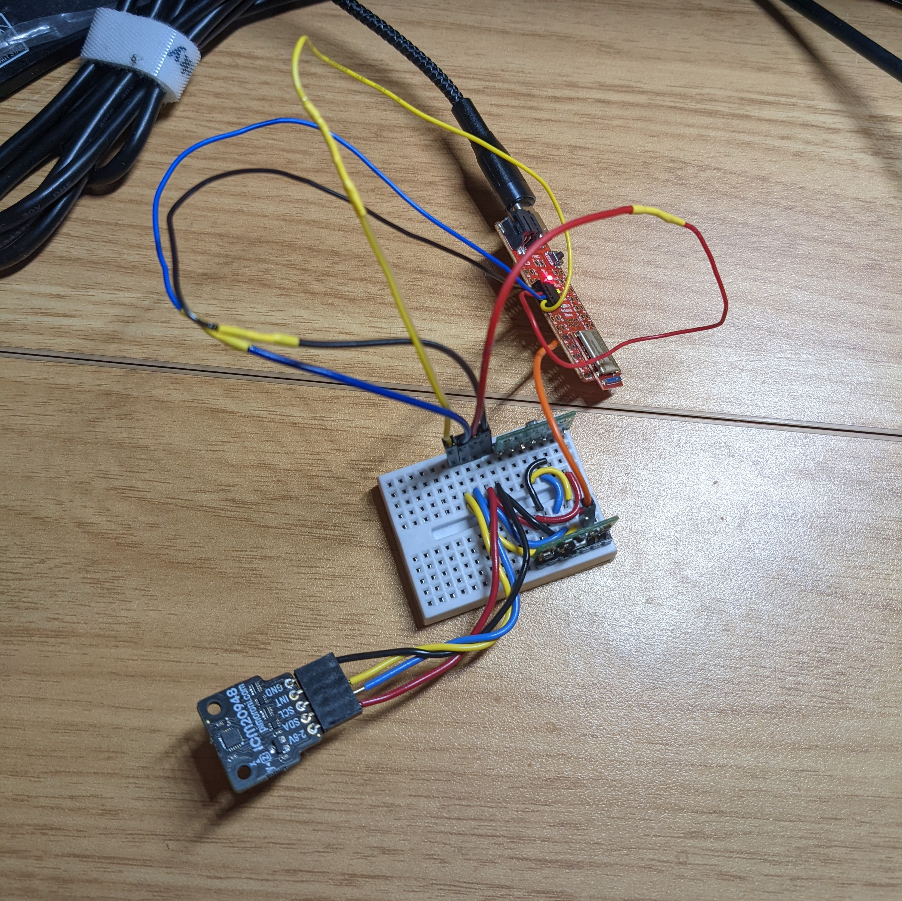
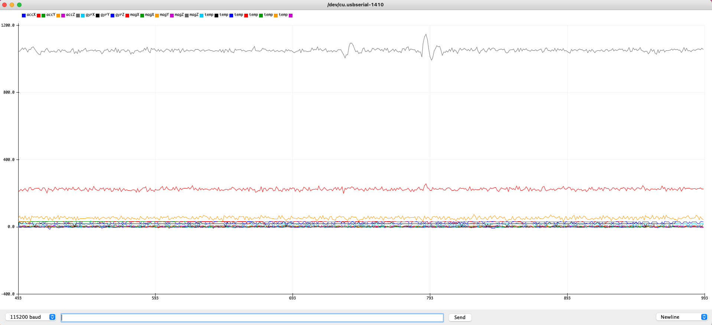
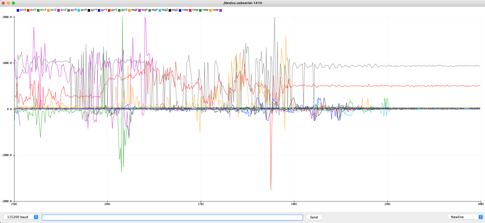
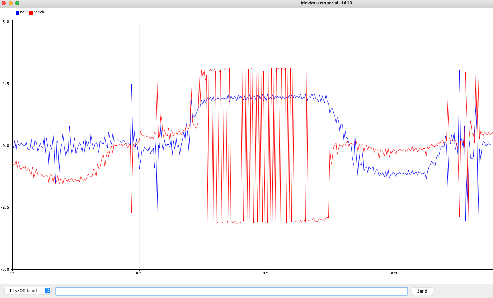
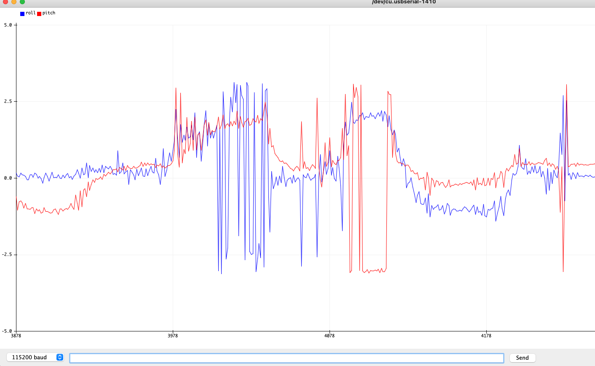
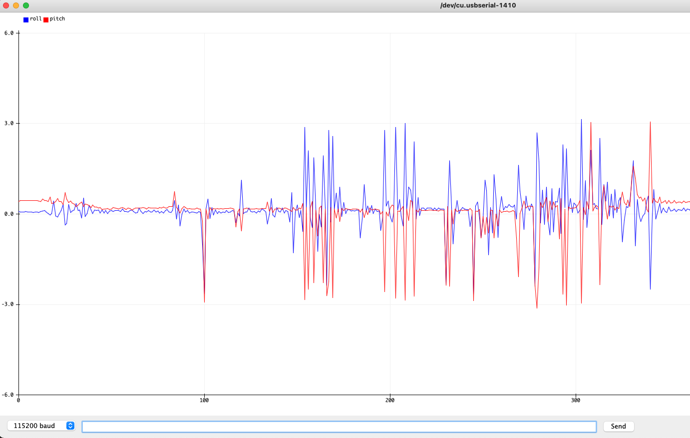
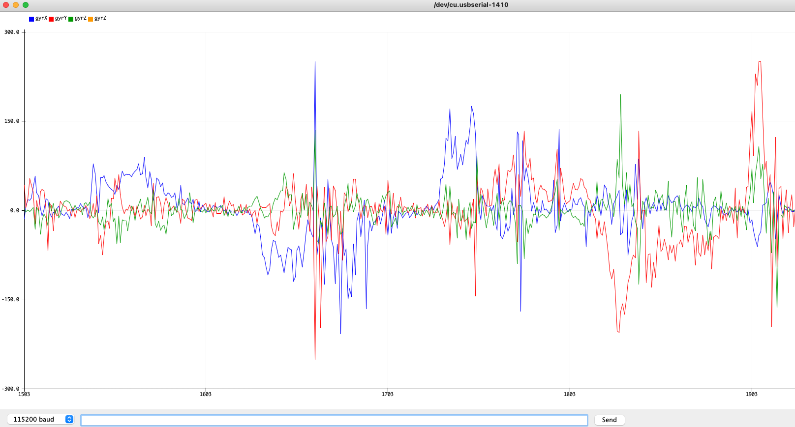
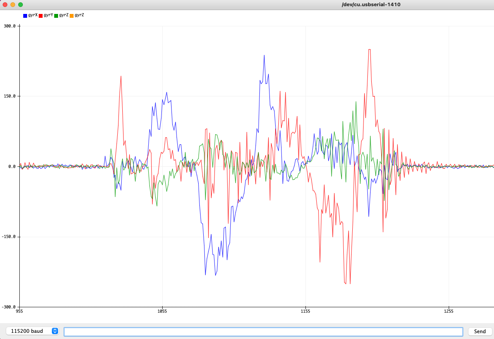

# Lab 3

## Summary

Lab 3 was an introduction to the VL53L1X Time-of-Flight (ToF) sensors and the Inertial Measurement Unit, or the IMU. I was able to configure them to work with the Artemis board, and I also learned the fundamentals of debugging and testing hardware to determine various characteristics of the sensors, like range and accuracy.

## Procedure

### Prelab

For the prelab, I decided that I would change the I2C addresses of the two ToF sensors programmatically on setup. I opted for this option because I thought that I could modularize the code once it was written so that it could be called in the `setup()` function on startup.

In terms of sensor placement, I think the two best places for the sensors are 45 degrees left and right from the front-facing axis. This is based on my knowledge of obstacle detection from a previous class where I worked with a driving robot and to avoid collision it was useful to be able to see both left and right symmetrically. This way, as long as the robot moves in a forward direction, it should not miss obstacles that are in vision range of the ToF sensors. However, there exist edge scenarios where commonplace objects like chairs could go undetected.

Configuring the wires for the ToF sensors and the IMU proved to be very difficult. First, I tried to solder all the connections together manually with normal wires, but the strategy failed miserably because of loose metal connections. Blame my soldering skills or not, I figured it would be worth prototyping on a breadboard to get the sensors working. However, I also realized that I could maybe try a mini-breadboard to attach to the car with all the wiring on the breadboard. The final implementation will be determined in future labs.

### Part (a): Time of Flight Sensors

The first part of the lab consists of configuring Time of Flight sensors for Arduino. To make sure the initialization went properly, I checked the I2C address of a single sensor, and sure enough, the address was what I expected, 0x29. (The command printed out 0x58, but I suspect that is because of bit shifting to the left once.)

Of the three modes available for ranging on the sensor, I believe all three have their uses. Of course, the main pro of the longer modes is their range because some applications will require longer available ranges. However, I would imagine the main downside of the longer ranges is that they take more power to compute the distances and range them.

Another hunch I had was that the longer ranges will be less accurate, but I was pleasantly surprised to see that the modes all work very well within their advertised ranges. The shortest range is good for the first ~1.3m, the medium range works well for ~3m, and the longest range is a whopping ~4m. Both the sensors were consistent in these measurements and I was able to repeat these measurements several times.

In terms of ranging times, I was able to follow the same procedure as the example code provided by SparkFun and observe that the ranging is incredibly fast. I actually had to slow it down by a bit to make sure the values were human-readable. I also noticed while testing the different colors and textures that there is very little variance with the types of materials I tested, in that they all work consistently well. This is a nifty little sensor!

Here is a demonstration of both the sensors working together. As mentioned before, setting up the sensors to read properly in tandem was a pain (weeks of effort T_T) but eventually it worked, so here it is:

  

  

### Part (b): IMU

The IMU presented another soldering project alongside the two ToF sensors. This was much easier because there was no need to reconfigure the I2C address of the IMU. The AD0_VAL definition was set to zero because the jumper is connected.

Once the IMU was configured and I was able to read the values on the serial monitor, I saw the acceleration and gyroscope data change (as expected) as I flipped, rotated, and moved the board back and forth. Here is the default example data with all the values showing:

  

...and here is when I moved the IMU around:

  

I converted the accelerometer data to pitch and roll using the `math.h` library in C and the `atan2` function. Here are the accelerometer data when the IMU was moved between -90 to 90 degrees:

  

  

As evident by the plots, the accelerometer data are noisy, yet consistent across an average period of some time. Using this fact, I was able obtain accurate results by implementing a complimentary low pass filter for the noise. However, this required analyzing the frequency spectrum when perturbed, so I tried tapping the IMU to see the frequency response:

  

Using some basic Python scripts for fast Fourier Transform, I was able to see that most of the frequency response averages around 3Hz to 10Hz. This means that an appropriate cutoff frequency for the filter could be chosen around 5Hz. The cutoff frequency simply determines at which frequency all the signals of higher frequencies will be reduced. We do not want to dramatically overreduce the frequency of our signal because it will cut our available data, but I believe 5Hz is a good middle ground. I was able to see less noise overall,

Another useful sensor on our IMU is the gyroscope. Using it, I was able to deduce pitch, roll, and yaw (which was previously unavailable with just the accelerometer). However, the data seem just as noisy as accelerometer data, which was unexpected. As such, it seems less useful than the accelerometer for data, other than to calculate changes in yaw, especially considering using a complimentary filter in addition to the raw accelerometer data. Here is the same rotation of the IMU as before, but with changes in roll, pitch, and yaw observed from the gyroscope data:

  

...and here is the filtered version:

  

## Conclusion

What a long lab this was! Thankfully, I was able to successfully complete the lab. I definitely gained a lot of useful knowledge on embedded systems throughout this lab and how to interface with sensors using serial. I also got hands-on experience on how ToF and IMU sensors work and what types of data they measure.

## References

- [Lab Handout](https://cei-lab.github.io/ECE4960-2022/Lab3.html)
- [IMU Lecture](https://cei-lab.github.io/ECE4960-2022/lectures/FastRobots-4-IMU.pdf)
- [Python Fourier Transform](https://alphabold.com/fourier-transform-in-python-vibration-analysis/)
- [Python Serial](https://pyserial.readthedocs.io/en/latest/pyserial.html)

[Back to main](../index.md)
