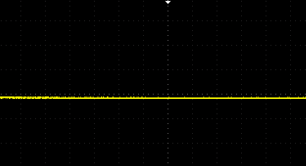
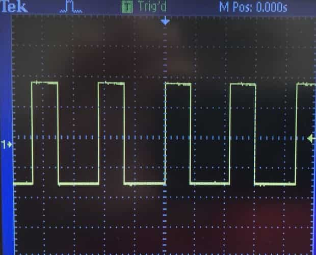
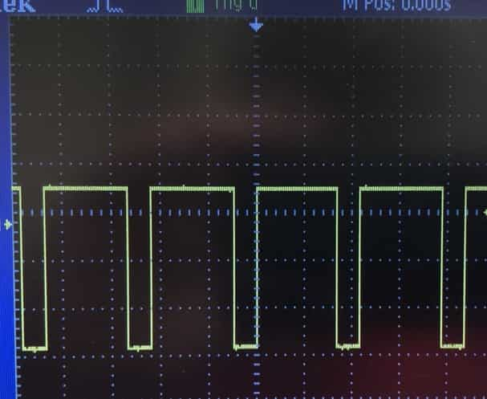

# Lab 5

## Summary

In this lab, I replaced manual control of the car from last week's lab by
rewiring the control to the Arduino code from the Artemis board. This process
was a hefty one as it involved both soldering and attaching a bunch of parts
together, as well as actually writing the code to control the car.

## Procedure

### Prelab

The first step in rewiring control from the car's RC transceiver to Arduino was
to solder two motor drivers to the existing motor leads on the car. That meant
figuring out the wiring for both the motor driver pins.

<p align="center">
  
</p>

As seen from the diagram above, this is more or less what I ended up doing,
except I did this for one motor instead of two per motor driver. This was to
ensure that the motors had enough current going through for the robot to be fast
enough, so I bridged the A and B in/out pins together (e.g. AIN1 and BIN1
together, AOUT2 and BOUT2 together, etc.). For control of the GPIO pins on the
motor drivers, I used AI0 and AI1 for the left motor, and AI2 and AI3 for the
right motor.

The rest are as the diagram shows, with VMM and the bottom four pins left
unconnected and the GND and VIN pins as shown. The motor power is supplied by an
external 850mAh battery, which powers both motor drivers simultaneously, and the
Artemis is powered by a separate 650mAh battery. This is to minimize the risk of
accidentally frying the Artemis board by drawing too much current from the
battery at once, as the motors will draw different amounts of current from their
battery depending on load.

Once I soldered all the connections together for the two motor drivers, the next
step was to ensure that the connections worked correctly. This was a simple
continuity test of using the multimeter on the various connections. After
verifying the connections, I hooked up the motor drivers to an oscilloscope and
a power supply with 3.5V as the output voltage and a very low current limit (as
we just want to verify that the motor driver works with minimal load). To
generate current, I used Arduino's `analogWrite` function to write int values
between 0 and 255 to generate PWM signals for the motor drivers. Here are the
outputs from 0, 100, and 200:

<p align="center">
  
</p>

<p align="center">
  
</p>

<p align="center">
  
</p>

After this, the next step was to put everything together and run the car in real
life. I was able to test individually that the motors worked by spinning forward
and backward by changing the Arduino code. Here is a short snippet to
demonstrate how I did it in the code:

```cpp
#define A1_LT_DR A0  // Left motor driver A1
#define A2_LT_DR A1  // Left motor driver A2
#define A1_RT_DR A2  // Right motor driver A1
#define A2_RT_DR A3  // Right motor driver A2

void lcw(int speed) {
  analogWrite(A1_LT_DR, speed);
  analogWrite(A2_LT_DR, 0);
  Serial.print("left clockwise ");
  Serial.println(speed);
}

void rcw(int speed) {
  analogWrite(A1_RT_DR, speed);
  analogWrite(A2_RT_DR, 0);
  Serial.print("right clockwise ");
  Serial.println(speed);
}

...

void drive(int direction, int speed) {
  switch (direction) {
    ...
    case FORWARD:
      lccw(speed);
      rcw(speed);
      break;
    case BACKWARD:
      lcw(speed);
      rccw(speed);
      break;
    ...
  }
}

void loop() {
  drive(FORWARD, 100);
  delay(1000);
  drive(STOP, 0);
  delay(1000);
  drive(BACKWARD, 80);
  delay(1000);
  drive(STOP, 0);
  delay(1000);
}
```

Here is the robot in full action, doing some forward/backward motion and turning
in place:

<p align="center">
  
</p>

A couple of observations from experimenting with the car motors:

1. The lower limit for the motors to run in opposite directions (driving forward
   or backward) seems to be around 25 for the PWM signal. (It runs extremely
   slowly, but still runs.)
2. I discovered that my motors do not run at the same rate, likely because the
   right motor is looser than the left. This is a typical problem with cars like
   these, so the way to fix it is not by mechanical treatment (e.g. tightening
   the screws) but by adding a calibration factor to the motors. I found that
   multiplying 0.4 to the right motor PWM value was a good balance to moving
   forward or backward reasonably well. Here is a demonstration of the robot
   following a straight line:

<p align="center">
  
</p>

## Conclusion

This was a tedious but rewarding lab to complete. A "necessary evil" of sorts,
correctly completing this lab allows me to now worry about the control purely
from the software side, as now the car can run off of commands from the Artemis
board!

## References

- [Lab handout](https://cei-lab.github.io/ECE4960-2022/Lab5.html)
- [DRV8833 Motor Driver Module specs](https://www.pololu.com/product/2130)
- [`analogWrite()` from Arduino
  docs](https://www.arduino.cc/reference/en/language/functions/analog-io/analogwrite/)

[Back to main](../index.md)
