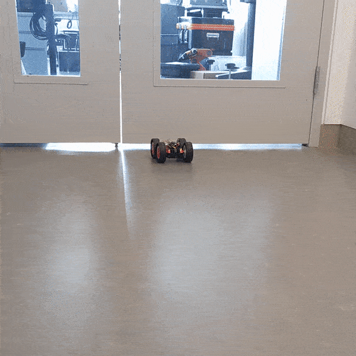

# Lab 6

## Summary

This lab was the first of many labs to come that aim to have the robot become
fully "autonomous" and able to perform stunts. As such, it involved a lot of
framework setup: combining hardware and code sketches from previous labs,
setting up Bluetooth to work alongside Python scripts, and setting up debugging.
Since much of this work is the [Prelab](#prelab) portion of the lab, the actual
main lab was neither as difficult nor time-consuming, which was to implement a
basic PID controller for regulating an accurate stop mechanism for the robot.

## Procedure

### Prelab

As mentioned in the [Summary](#summary), the Prelab was the main portion of the
time consumption of the lab. The procedure can be broken up as follows:

1. Hardware & Software Integration
2. BLE Setup for Arduino & Python
3. Debugging

The first step was integrating the hardware (sensors and car chassis) with the
existing code (firmware sketches from previous labs). Specifically, I had to
combine the sketches for activating and collecting data from the sensors,
controlling the motors, and running commands from BLE characteristics. The code
can be found in the repository for the class (linked on this website) in the
main branch.

Once this was done and all the bugs were cranked out, it was time for BLE setup.
BLE is the Bluetooth interface we used for [Lab 2](../2/index.md), which allowed
us to load and store values on the Artemis board from characteristics that we
received from a Jupyter notebook. For this, I created an entirely new interface
that overlays the BLE code from earlier to able to support running commands on
the Arduino at will. For example, after the interface was completed and working,
I was able to run `drive_forward(150)` on Python to make the robot drive forward
with a PWM value of 150. Another (realistically more important) command was
`start_pid_control()` which enables the Python script to control when to start
PID control on the Arduino side, which meant that the robot no longer had to
rely on a deterministic start behavior from the sketch, but rather could be
turned on or off from the Python side via BLE.

The final step was debugging. Debugging the code in a systematic way is crucial
in general and for future labs, since we have so much code to work with at once
now. As such, adding a systematic way of debugging the code on both the Arduino
and Python backends was important work to get out of the way sooner than later.
To tackle this, I added a new deque for each characteristic sensor value (front
ToF sensor, right ToF sensor, and IMU) that could store up to a specified max
capacity number of recent sensor readings, alongside with the time at which the
reading was taken. Though the times were not immediately useful for this lab,
being able to store the sensor readings on the Python backend was a crucial step
for data collection and manipulation for future labs, like the [Kalman filters
lab](../7/index.md).

  

### Task A: Don't Hit the Wall!!

With all the setup out of the way, the main portion was all that was left for
this week's lab. I opted to implement the first task, which was designing a PID
controller to regulate the robot's velocity in such a way that it stops as
accurately as possible 300mm from the wall. Though the goal of the lab is pretty
straightforward, the challenge arose from two facts: first, the ToF sensor
readings are not always reliable (i.e. the average sensor readings over time do
not always correspond to the instantaneous readings due to high variance and
noise); second, overshooting the setpoint from the wall is a real possibility
that has to be dealt with.

To overcome these challenges, I had to tune my PID values for the controller to
adjust for different scenarios correctly. My first instinct was that I would
need a high value for the integral and derivative values, but I was dead wrong.
Because of the way I set up my PID controller to measure error proportional to
the distance from the designated setpoint (300mm) based on the front ToF sensor
reading, I realized that the integral term was practically useless as the
accumulated error would be drastically high, especially if the robot started
from a far distance away from the wall. The derivative term was less useless,
but when I increased the coefficient value, it actually made the robot's change
in velocity (acceleration and deceleration) become slower. As a result, it was
much harder to stop right at the setpoint and sometimes would even crash into
the wall without stopping. So, even though I thought I would have to tune all
three parameters to some nonzero constant value, I realized that the best way
for the robot to come to a hard stop was just using a simple P controller, at
least for the way I defined the PID error value. Using a simple `K_p = 1` and
`K_i = K_d = 0` was what I ended up opting for.

However, as you can probably guess, using such a simple controller is not
entirely sufficient to make the robot come to a hard stop due to overshoot.
Overcoming this problem required extra intervention on regulating the velocity.
What I ended up doing was dynamically changing the speed at which the robot
moves by scaling the range of output velocities with respect to a reasonable set
of input range values of the front ToF sensor readings. In other words,
depending on how far the robot was from the setpoint, the speed was adjusted
every time the sensor was sampled. As such, there was extremely small overshoot
from the wall, and after some tuning of the ranges, I was able to get the robot
to an almost nearly accurate hard stop at the desired setpoint of 300mm from the
wall. Here are videos of the robot successfully doing its work:

  

  

  

## Bloopers

When the PID controller works but the right motor moves too fast:

  

Wall of light! Still works... I guess?

  

...and I have no idea what happened here:

  

(Many wires were resoldered after this last trial run.)

## Conclusion

Overall, a very work-intensive lab, but worthwhile all the same! Completing this
lab allowed me to finally put together all the parts from the previous labs and
as a result made the robot feel a lot more autonomous. I learned more about BLE
communication, abstraction of functionality between the Python and Arduino
backends, and how to use PID control to regulate precise speeds for the robot.

## References

- [Lab handout](https://cei-lab.github.io/ECE4960-2022/Lab6.html)
- [PID control -
  Wikipedia](https://www.omega.com/en-us/resources/pid-controllers)

[Back to main](../index.md)
