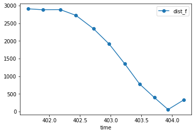
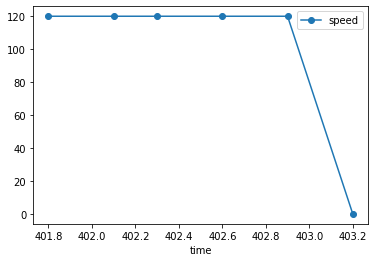
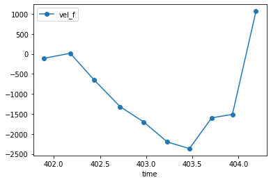
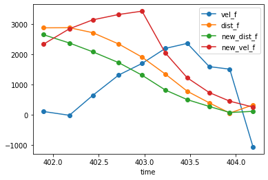
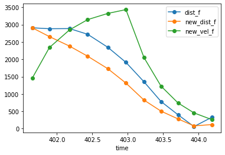
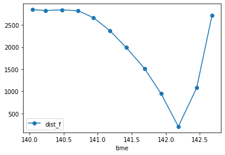
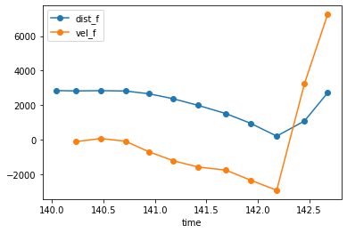
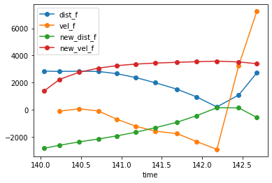

# Lab 7

## Summary

In this lab, I had to implement a Kalman filter in both Python (simulation) and
in the robot for real-time sensor data. The goal was to use the Kalman filter
alongside the PID controller we developed in [Lab 6](../6/index.md) to upgrade
our robot's stop behavior at a specified waypoint from the wall.

## Procedure

### Step response

The first action item of the lab involved a step response from the robot. A step
response involves running the robot at "full" speed at the wall to see the
steady-state velocity and the warmup time. These two are important parameters
for the Kalman filter setup, so I conducted the test several times to ensure
relative accuracy of these values.

I used a "top" PWM value of 120 for this lab to stay consistent with the last
lab. Since there was very little room for the robot to fully warm up if I
started 4m away from the wall, I had to go farther back for this test.
Eventually, I succeeded, and here are the graphs for the front ToF distance, the
PWM motor values, and the derived (flipped) velocity:

<p align="center">
    
</p>

<p align="center">
    
</p>

<p align="center">
    
</p>

From these, I was able to find my steady state velocity to be 2500mm/s and my
90% rise time to be 1.5s. Thus, my drag is 1/2500 = 0.0004, and mass = -0.0004
(1.5) / ln(0.1) = 0.0002606 = 2.61 \* 10^-4. With these, I was finally ready to
implement the Kalman filter.

### Kalman filter setup

To begin, I had to reason about what values for process noise and sensor noise
made sense. I wanted to start with default values given in the lab handout, plus
ballpark values that others in the class used, which meant `sigma1 = sigma2 = 10` and `sigma3 = 20`. Therefore, my final expressions for the noise values were
`sig_u = np.array([[100, 0], [0, 100]])` and `sig_z = np.array([[200]])`.

With these, my final A, B, and C matrix values were the following:

```python
d = 4e-4   # drag
m = 2.61e-4 # mass

# A, B, C matrices
A = np.array([[0,1],[0,-d/m]])
B = np.array([[0],[1/m]])
C = np.array([[-1,0]])
```

(I didn't bother calculating these out by hand. That's what computers are good
for!)

With these parameters, I developed the final Kalman filter setup in Python:

```python
# Initial state uncertainty
sig = np.array([[5**2,0],[0,5**2]])

d = 4e-4   # drag
m = 2.61e-4 # mass

# A, B, C matrices
A = np.array([[0,1],[0,-d/m]])
B = np.array([[0],[1/m]])
C = np.array([[-1,0]])

# Process and sensor noise
sig_u = np.array([[10**2,0],[0,10**2]])
sig_z = np.array([[20**2]])

# Discretize A and B
delta_t = dist_f["time"].diff().mean()
Ad = np.eye(2) + delta_t * A
Bd = delta_t * B

# Initial state
x = np.array([[-dist_f["dist_f"][0]],[0]])

# KF estimation
def kf(x,u,sig,y):
    x_p = Ad.dot(x) + Bd.dot(u)                      # predicted state
    sig_p = Ad.dot(sig.dot(Ad.transpose())) + sig_u  # predicted state uncertainty

    y_m = y-C.dot(x_p)
    sig_m = C.dot(sig_p.dot(C.transpose())) + sig_z

    kf_gain = sig_p.dot(C.transpose().dot(np.linalg.inv(sig_m)))  # KF gain

    x_n   = x_p + kf_gain.dot(y_m)                   # new state
    sig_n = (np.eye(2) - kf_gain.dot(C)).dot(sig_p)  # new state uncertainty

    return x_n, sig_n

# Run code
kf_state = []
for u, d in zip(pwm["pwm"], dist_f["dist_f"]):  # pwm and dist_f are pandas DataFrames
    x, sig = kf(x, [[u/80]], sig, [[d]])
    kf_state.append(x[:,0])
```

(Huge thanks to [Anya](https://anyafp.github.io/ece4960/labs/lab7) for her code,
I only changed it a little for my personal use. All the credit goes to her!)

Here is the Kalman filter output for the step response:

<p align="center">
    
</p>

And here is the same graph but without the KF-computed velocity values that
clutter up the chart a bit:

<p align="center">
    
</p>

As you can see, the Kalman filter does a pretty good job of smoothing out the
distance values, which is what a filter of this sort should do. This is a good
sanity check to demonstrate that our system works as intended, which means we
are ready to move on to finally implementing this Kalman filter on the real
robot in real-time.

For added sanity, though, I decided to try a couple more runs to see if it
wasn't just pure luck or coincidence that the filter worked so well. Here are
additional data to demonstrate its reliability, where this run involved
purposefully crashing into the wall:

<p align="center">
    
</p>

<p align="center">
    
</p>

<p align="center">
    
</p>

(Sorry, I forgot to reverse the distance values on the ToF sensor data, which is
why it looks flipped. But otherwise all good!)

### Kalman filter on the Arduino

To implement the Kalman filter on the Arduino firmware, I used a matrix library
called BasicLinearAlgebra. With it, I was pretty much able to copy and paste the
Python code over with a few changes.

With the Kalman filter acting on the ToF sensor data, I was finally ready to
evaluate the performance of the filter in real life. Here is a successful run of
the robot performing the same task from Lab 6, but with the Kalman filter:

<p align="center">
    
</p>

Here's another run, this time less successful at hitting the waypoint exactly,
but still close enough:

<p align="center">
    
</p>

## Conclusion

Overall, I think I saw minor improvements from the PID controller alone, which
is a plus. However, coupled with several more test runs to fine-tune my
parameters for the filter and the PID controller, there is a lot more room for
improvement. Even in its current stage, however, the Kalman filter does the job
of stopping at a specified waypoint pretty well.

## References

- [Lab handout](https://cei-lab.github.io/ECE4960-2022/Lab7.html)
- [Kalman filter slides
  1](https://cei-lab.github.io/ECE4960-2022/lectures/FastRobots-11-LQR-KF.pdf)
- [Kalman filter slides
  2](https://cei-lab.github.io/ECE4960-2022/lectures/FastRobots-12-KF-Navigation.pdf)

[Back to main](../index.md)
