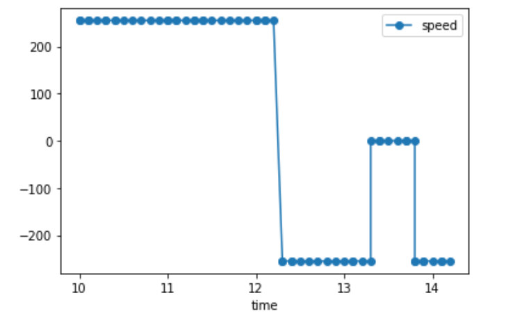

# Lab 8

## Summary

This lab was putting together all the previous labs done until this point to
allow our robots to perform stunts. As we were allowed to be truly creative in
this lab, it allowed me to stretch my imagination for what is possible with the
RC car robot.

## Procedure

### Controlled Stunts

For this lab, I chose to implement the first stunt option, which involves
driving the robot as fast as possible at a wall, then right before it hits the
wall, flipping backwards and driving back from where it came from.

I chose this task for a couple of reasons. First, this task seemed to be in line
with the task I chose to do in [Lab 6](../6/index.md), which meant less work
than the other option. Second, this task seemed to be the most practical option
considering how I could default back to a completely open-loop solution if
things went south (and they did... somewhat). Most importantly, this was a cool
task that would make for some interesting clips, as you will see.

To time the flip for the robot, I used a PID controller, similar to my solution
in Lab 6. However, because the robot was moving at the highest speed (this was
required for the robot to flip successfully), I learned quickly that the ToF
sensor values were too delayed. My solution to this problem was by increasing
the 500mm threshold in order to account for the high velocity and the processing
delay, which worked out pretty well in the end.

```cpp
void stunt()  // Continuously called in the main loop
{
  int waypoint = 500;  // This value was tuned as I ran tests
  if (pid(tx_tof_f_value, waypoint) > waypoint) {
    drive(FORWARD, 255);
  } else {
    drive(BACKWARD, 255);
    delay(1000);
    drive(STOP, 0);
    delay(500);
    drive(BACKWARD, 255);
    delay(1000);
    drive(STOP, 0);
    stunt_running = false;  // Stops calling stunt() in the main loop
  }
```

Here is a graph of the PWM values of the motors:

<p align="center">
  
</p>

Here is a video of the robot performing the stunt. Even though the robot did not
technically cross over the start line at the end, it certainly would have if it
did not change angles after the flip, which is sort of out of my control
unfortunately:

<p align="center">
  <iframe width="541" height="961" src="https://www.youtube.com/embed/ThtfLcwtQpw" title="YouTube video player" frameborder="0" allow="accelerometer; autoplay; clipboard-write; encrypted-media; gyroscope; picture-in-picture" allowfullscreen></iframe>
</p>

### Open-Loop, Repeatable Stunts

Now that the required stunt was out of the way, I was free to try other,
exciting stunts. I wanted to be very ambitious at first and tried to get the
robot to draw a nautilus shell-like spiral shape, but I soon realized that this
was a risky stunt for the robot to repeatedly perform, as is evident by these
videos:

<p align="center">
  <iframe width="541" height="961" src="https://www.youtube.com/embed/1P47A9Jo1MQ" title="YouTube video player" frameborder="0" allow="accelerometer; autoplay; clipboard-write; encrypted-media; gyroscope; picture-in-picture" allowfullscreen></iframe>
</p>

<p align="center">
  <iframe width="541" height="961" src="https://www.youtube.com/embed/i_NbrJFld0E" title="YouTube video player" frameborder="0" allow="accelerometer; autoplay; clipboard-write; encrypted-media; gyroscope; picture-in-picture" allowfullscreen></iframe>
</p>

<p align="center">
  <iframe width="541" height="961" src="https://www.youtube.com/embed/wKV0v8yAPqs" title="YouTube video player" frameborder="0" allow="accelerometer; autoplay; clipboard-write; encrypted-media; gyroscope; picture-in-picture" allowfullscreen></iframe>
</p>

(Needless to say, I am worried about the structural integrity of the robot after
these runs. Yikes)

So, I settled for an easier, safer stunt: spinning really fast in place. This is
a lot more boring, but I figured it was the best option without spending too
much extra time on stunts.

<p align="center">
  <iframe width="90%" height="920" src="https://www.youtube.com/embed/CO1QcMciUhI" title="YouTube video player" frameborder="0" allow="accelerometer; autoplay; clipboard-write; encrypted-media; gyroscope; picture-in-picture" allowfullscreen></iframe>
</p>

<p align="center">
  <iframe width="90%" height="920" src="https://www.youtube.com/embed/Hi2qkZ8xfEg" title="YouTube video player" frameborder="0" allow="accelerometer; autoplay; clipboard-write; encrypted-media; gyroscope; picture-in-picture" allowfullscreen></iframe>
</p>

Here is the (very simple) control sequence:

```cpp
for (int i = 0; i < 10; i++) {
  drive(RIGHT, 200);
  delay(50);
}
drive(ASTOP, 0);
```

### Bloopers

Please enjoy these bloopers at the expense of my (and the robot's) painful
moments:

<p align="center">
  <iframe width="541" height="961" src="https://www.youtube.com/embed/6yhOwxV9f6o" title="YouTube video player" frameborder="0" allow="accelerometer; autoplay; clipboard-write; encrypted-media; gyroscope; picture-in-picture" allowfullscreen></iframe>
</p>

<p align="center">
  <iframe width="541" height="961" src="https://www.youtube.com/embed/QFcpub4qeY8" title="YouTube video player" frameborder="0" allow="accelerometer; autoplay; clipboard-write; encrypted-media; gyroscope; picture-in-picture" allowfullscreen></iframe>
</p>

<p align="center">
  <iframe width="541" height="961" src="https://www.youtube.com/embed/lvVoOA9c5I4" title="YouTube video player" frameborder="0" allow="accelerometer; autoplay; clipboard-write; encrypted-media; gyroscope; picture-in-picture" allowfullscreen></iframe>
</p>

## Conclusion

Overall, this lab was a fun one! It was rewarding to put all the knowledge from
the previous labs into practice.

## References

- [Lab handout](https://cei-lab.github.io/ECE4960-2022/Lab8.html)

[Back to main](../index.md)
