# Lab 9

## Summary

In this lab, I had to create a mapping of the lab environment using the sensors
on the robot car. Specifically, using both the gyroscope data on the IMU and the
forward distance data with the front time-of-flight sensor, the map had to be created
using the localized points obtained from the robot spinning around in-place.

## Procedure

### PID Control

To tune the robot's movement, I had to work with the gyroscope data that was
fed as input into a simple PID (specifically, P) controller. After some repeated
iterations and tuning, I was able to tune the PWM values fed into the motors
to rotate the car clockwise at roughly 25 degrees per rotation for 14 rotations.

With some delays between the rotations, I had to come up with a strategy to ensure
that the angular velocity readings were valid. This was especially tough as I
had to rewrite my firmware code to allow for sensor measurements to be taken at
precise moments during the whole spin motion sequence. After some tuning, I was able to
obtain roughly equal points of angular velocity data with the P controller:

<p align="center">
  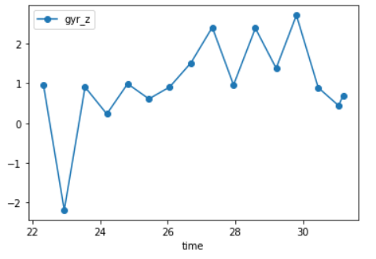
</p>

My initial concern before I got the orientation control down was that my car would
have issues drifting. (As such, I would expect pretty accurate results for
spinning around in-place in a square room.)
However, as it turned out, it wasn't much of an issue. What DID
become an issue, however, was that my cumulative turn sequence would sometimes
overshoot a full circle of 360 degrees. This was an interesing problem, as I could
reliably reproduce the roughly same overshoot at different points in the environment.
For example, at the first point, the robot would spin 360 degrees mostly correctly,
but at the second point, the robot would overshoot the circle by around 30 degrees.
I suspect this is due to different points having slightly different terrains and/or
contours, but this is pretty much impossible to overcome as I opted for orientation control,
and angular velocity accumulation will certainly have noise that the PID controller
cannot fully accommodate. (I will revisit this point later; this may explain why my
map ended up looking pretty weird.)

Here is a video of my robot spinning around in-place:

<p align="center">
  
</p>

### Read Out Distances

Once the robot was able to reliably spin in-place a full circle, it was time to
read the front TOF sensor data at the same interval. Because I did not have a use
case for aligning the IMU and TOF sensor data before this lab, I had to rewrite
my firmware code to synchronize the data output for all sensors. I also made sure
to start the robot spin sequence each time facing the same direction (the front
TOF sensor pointing perpendicular to the lab entrance door).

Because I felt that my orientation control was good enough, I trusted the TOF
sensor readings to be roughly equal in angular space; that is, 25 degrees each.
This ended up being a fine approach, as evidenced by the polar plots that I obtained
from the readings. For example, this was a polar plot of the TOF sensor readings
for a small, square environment that I set up:

<p align="center">
  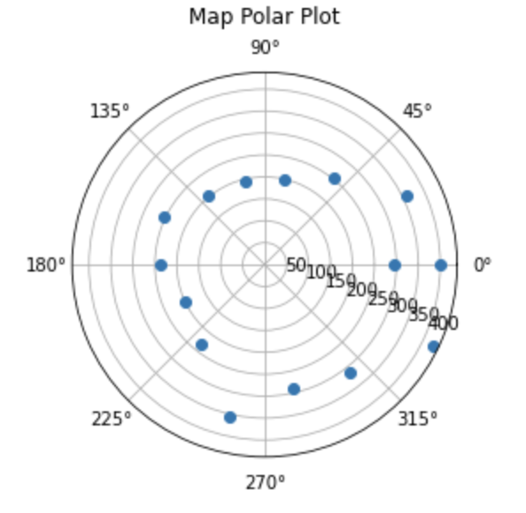
</p>

Here are the polar coordinate plots for each of the five designated points in
the lab space, with two trials for each:

<p align="center">
  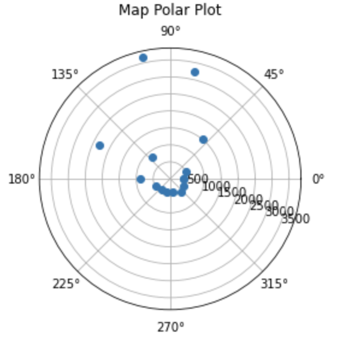
  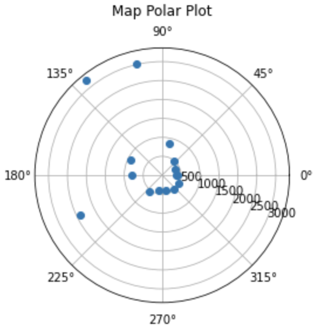
  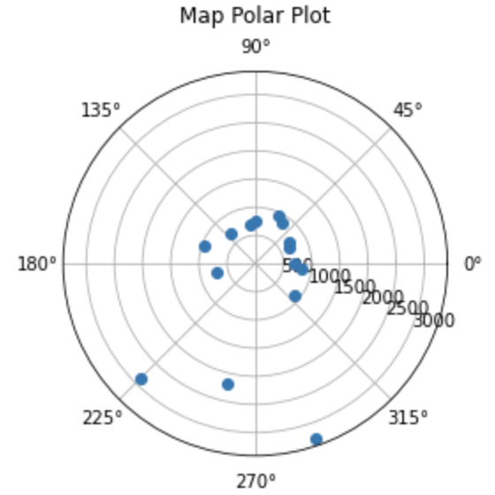
  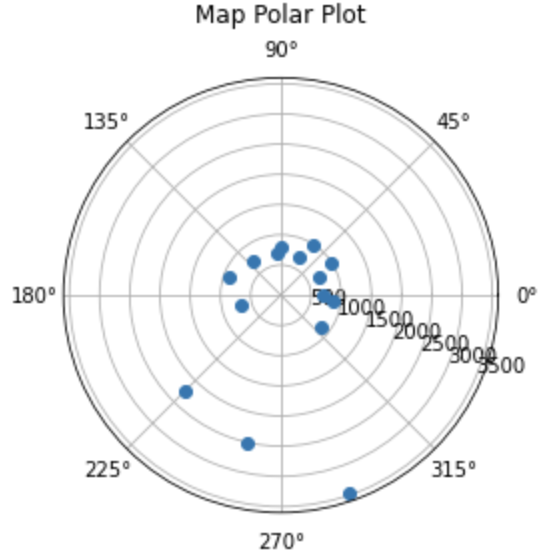
</p>

<p align="center">
  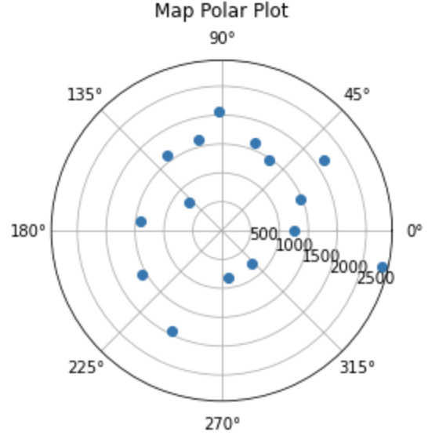
  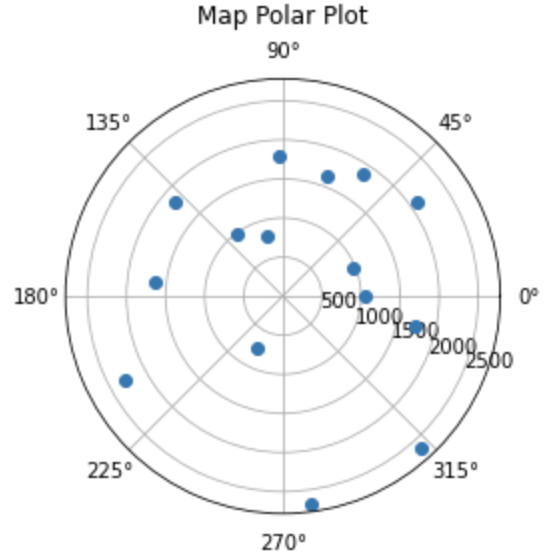
  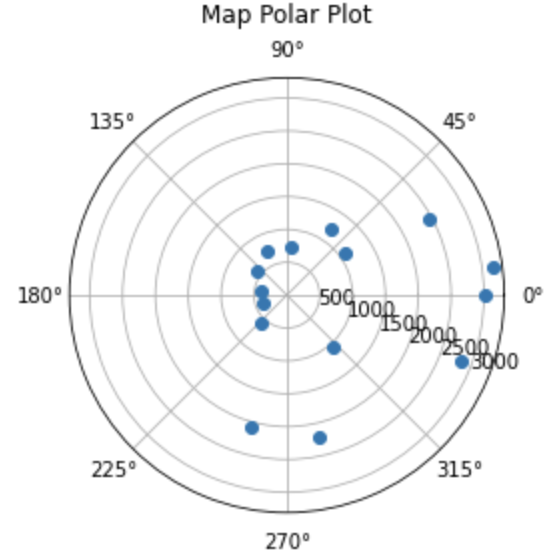
  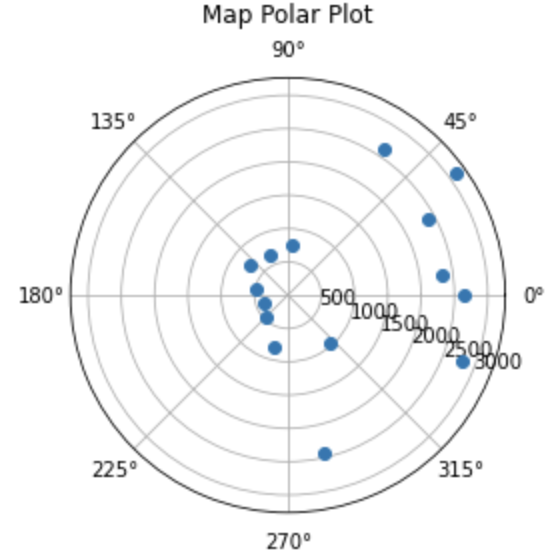
</p>

<p align="center">
  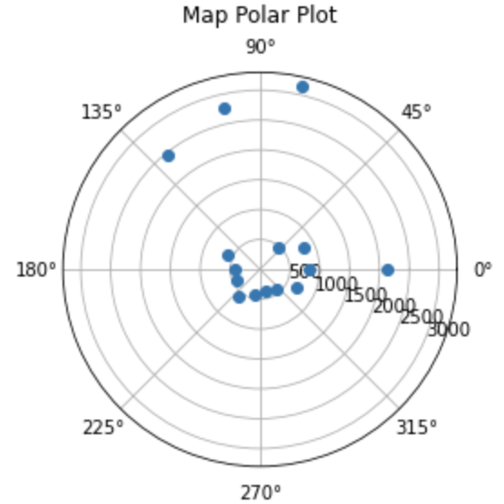
  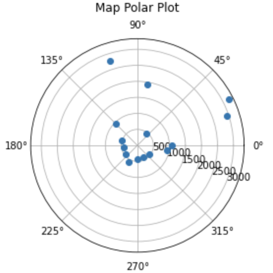
</p>

As one can see, the points do not always align correctly because of imprecise starting orientation measurements. This was expected, and as such, the mapping that relied solely on these points came out very weirdly.

### Merge and Plot Your Readings

Using basic geometry and knowledge of transformation matrices, I was able to
obtain the Cartesian coordinates of the readings from the distance and angle
measurements. This was easy because all the measurements started from the same
angular orientation (facing the door), so no rotations were needed. As such,
the simple equations for the x-y coordinates were:

```
x = dist * cos(θ)
y = dist * sin(θ)
```

Keeping in mind that these new x-y coordinates were
relative to their points of origin, I had to further
translate them by adding the coordinates of the points of origin. These were
in feet, so I converted them to millimeters by applying a simple conversion factor
of 1 ft = 308 mm.

Here are the resulting plots of the individual point readings (before translation
to the true (absolute) frame of reference):

<p align="center">
  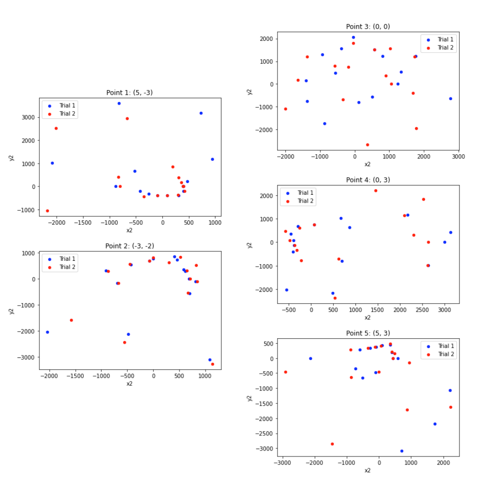
</p>

And here is the final map from the culmination of all the points on a single
plot after translation:

<p align="center">
  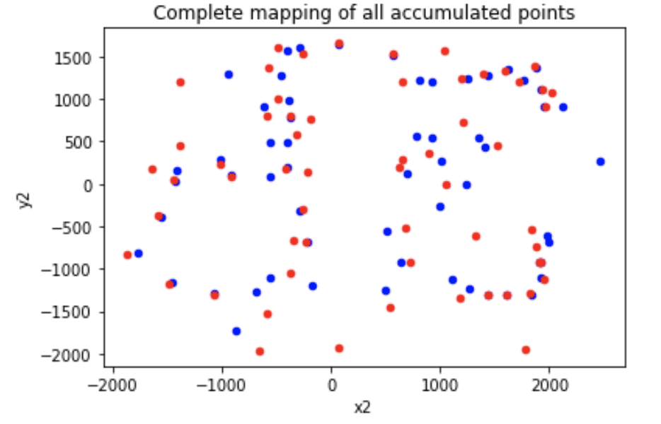
</p>

Yikes! It's not the prettiest looking thing, and certainly something that can be improved with more time.
Almost certainly, sampling more points would help with reliability and accuracy. Another, more tedious option is manually rotating the polar plot data to align with each other more closely before processing them to Cartesian coordinates.

After some manual filtering of the points, here is the map that I believe resembles the actual environment the best:

<p align="center">
  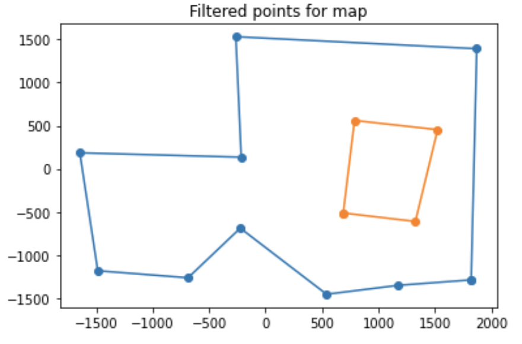
</p>

Though it still lacks a lot of key feature points, especially for corners, it hopefully does the job well enough for the overall boundaries. I could also have interpolated extra points that were not present in the original set of sampled points, but because I don't want to put too much emphasis on my prior belief of the environment, I left the map as is.

## Conclusion

This lab was a nice break from the last couple of labs which all involved
some sort of autonomous driving. Even though lab 9 still required a bit of
closed-loop control in the form of limited PID control, this was a good experience
to learn about how to create a localization of where the robot exists in a
real-world sense. Though the map did not come out as neatly as desired, I hope
to further improve on the quality of the mapping in future labs as required.

## References

- [Lab handout](https://cei-lab.github.io/ECE4960-2022/Lab9.html)
- [Lecture on transformation matrices](https://cei-lab.github.io/ECE4960-2022/lectures/FastRobots-2-TransformationMatrices.pdf)

[Back to main](../index.md)
