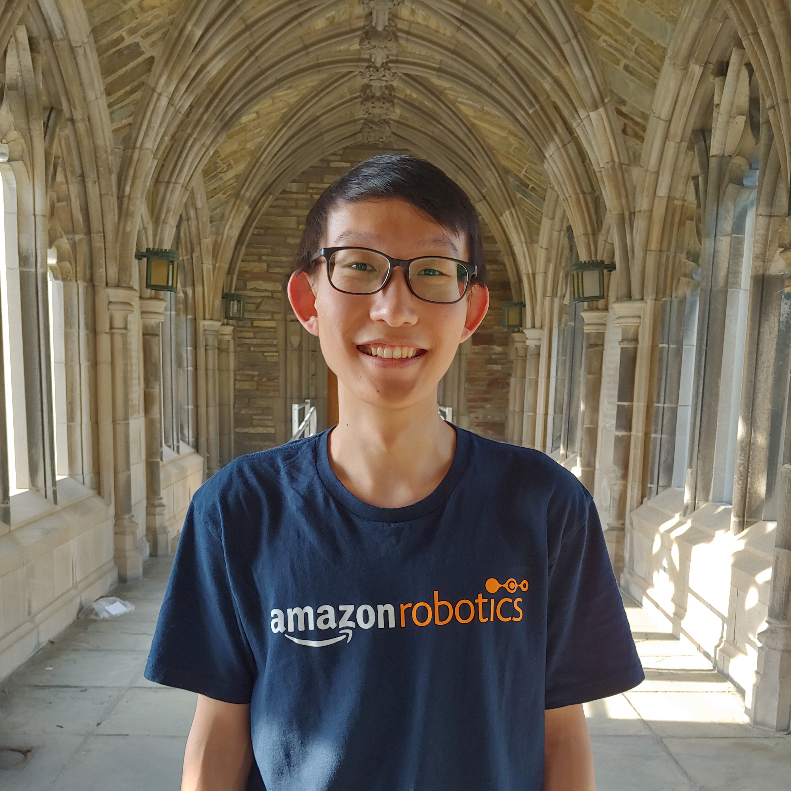

# ECE 4960: Fast Robots

Hello! Welcome to my website for ECE 4960: Fast Robots. Here, you will find my
write-ups for each lab and a brief description of who I am.

## Labs

- [Lab 1: Artemis](1/index.md)
- [Lab 2: Bluetooth](2/index.md)
- [Lab 3: Sensors](3/index.md)
- [Lab 4: Car Characterization](4/index.md)
- [Lab 5: Open Loop Control](5/index.md)

## Bio

Hi, my name is David Kim. I'm an undergraduate senior in ECE & CS, planning to
pursue a Ph.D. in robotics and machine learning and I am super stoked about this
class!! ^\_^

In my free time, I like to try to improve my cooking, jazz improv piano, and
League of Legends skills. You can find out more about me on my [personal
website](http://heydavid.kim).
